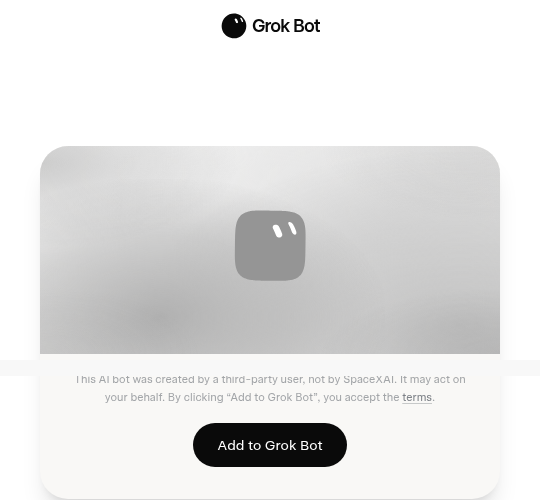

# Awesome Grok Bot

[English](README.md) · [中文](README.zh-CN.md)

> 社区维护的 Grok Bot 公开分享索引。这里不是 Grok Bot 源码，也不是安装器。

[Grok Bot](https://docs.x.ai/grok-bot/overview) 是一款让具名 AI 队友在共用云电脑上持续工作的应用。这个仓库帮你找到公开 Bot 配置，先在 `x.ai` 预览，再添加到自己的账号。

## 目录

- [怎么用](#怎么用)
- [真人案例](#真人案例)
  - [编制](#编制)
  - [电脑上手活](#电脑上手活)
  - [踩坑](#踩坑)
- [官方文档](#官方文档)
- [团队配方](#团队配方)
- [Coding & shipping](#coding--shipping)
- [Inbox & calendar](#inbox--calendar)
- [Research & briefings](#research--briefings)
- [Customer & sales](#customer--sales)
- [Finance & ops](#finance--ops)
- [Content & publishing](#content--publishing)
- [Personal admin](#personal-admin)
- [Teams & handoffs](#teams--handoffs)
- [技能和工具](#技能和工具)
  - [Linux 笔记本客户端](#linux-笔记本客户端)
  - [本地和研究](#本地和研究)
  - [模型和工厂](#模型和工厂)
  - [CLI 和 SDK](#cli-和-sdk)
  - [聊天桥](#聊天桥)
  - [技能包和玩法](#技能包和玩法)
  - [索引](#索引)
  - [开源替代](#开源替代)
- [社区教程](#社区教程)
- [评测](#评测)

## 怎么用

先在 Mac、Windows 或 iPhone 上[安装 Grok Bot](https://docs.x.ai/grok-bot/get-started)。打开一条分享，点 **Add to Grok Bot**。

  

分享会带上名字、技能、例行任务和官方市场插件。不会带上电脑、文件、登录或 API key。

Bot 共用一台云上的 Linux 电脑（上限 50 个）。那不是你桌上的 App。没有官方 Linux 桌面端。自己电脑是 Linux 的，看 [Linux 笔记本客户端](#linux-笔记本客户端)。

付费 Cursor 和 SuperGrok 都带 Grok Bot。账单看 [plans](https://cursor.com/help/grok-bot/plans)。

> 社区分享是不可信的第三方软件。先看 profile，只接一个连接器，先跑只读任务，再开写入。不要把 API key 写进 SETUP。见 [SECURITY.md](SECURITY.md)。

2026 年 9 月 1 日检查时，289 个分享页全部返回 HTTP 200。这只能证明页面能打开，不能证明 Bot 安全或能按描述工作。[catalog.json](catalog.json) 中的 `verified: true` 表示维护者已经导入并完成一次安全的首次任务。

### 按工作类型找

| 分类 | 收录数 |
| --- | ---: |
| [Coding & shipping](#coding--shipping) | 42 |
| [Inbox & calendar](#inbox--calendar) | 21 |
| [Research & briefings](#research--briefings) | 35 |
| [Customer & sales](#customer--sales) | 22 |
| [Finance & ops](#finance--ops) | 29 |
| [Content & publishing](#content--publishing) | 49 |
| [Personal admin](#personal-admin) | 45 |
| [Teams & handoffs](#teams--handoffs) | 46 |
| **合计** | **289** |

当前核验状态：**0 条已核验 / 289 条已收录**。

## 真人案例

公开写过、真正跑过的。

### 编制

- [CasJam 的 13 Bot 产品编队](https://x.com/CasJam/status/2093762642867581359) - 一个总参谋，四个品牌各配 Head、Growth、Maintainer。
- [n2parko 的 SpaceXAI 花名册](https://x.com/n2parko/status/2087251704744235298) - 参谋、EM、五个工程 IC，还有 Bot 之间交 PR 的截图。
- [Farzad 的具名专长](https://x.com/farzyness/status/2087340859138224540) - Webby、Shorty、Writey 听一个调度的。
- [Tyler 的两扇门](https://x.com/TylerNishida/status/2093426221732532457) - Work 和 Life 两只常驻收件箱。混着的活一律给 Life。
- [Gota 的十二件活](https://x.com/gota_bara/status/2087666940450152841) - 出图、简报、3D、出行、退订，虚拟机上还跑本地大模型。
- [Nate 八小时搭十二个 Bot](https://natesnewsletter.substack.com/p/grok-bot-review) - 第一天花名册，并问 200 美元的代理团队值不值。
- [Krista 的企业获客编制](https://x.com/kristaletz/status/2089103618121314689) - 参谋、夜间拓客、按客户配专长、现场改幻灯片。
- [Ben Lang 的内部活单](https://x.com/benln/status/2087929147406299313) - 偏 Starlink 的航班、菜谱下单、胶片 EXIF、找承包商报价。
- [Jon 的管道店办公室经理](https://x.com/HouseHackerJon/status/2087635639701573962) - 下水道店老板第一天就把后台行政交给 Bot。
- [Grokularity](https://grokularity.xyz) - 不会写代码的人一天搭出公司站。人只读，写站的是核过的 Grok 代理。
- [Mo Bitar 的八个机器人店](https://atmoio.substack.com/p/i-went-in-ready-to-hate-grok-bot) - 一天下午搭起八个具名机器人，其中博客管家在没人告知文件路径的情况下把改动推上了线。
- [Remy 的 Alfred、Gordon 和 Florence](https://aiwithremy.beehiiv.com/p/what-i-m-actually-using-grok-bot-for) - 运维 Alfred、内容 Gordon、商务 Florence。Alfred 把 NDA 交给 Florence，Gordon 发推卡住一小时。
- [Billy Howell 的 Arlington Bagel](https://www.thefuturist.co/making-with-grok-bot/) - 每周四 6000 订户的通讯，幕僚长加研究和销售机器人。销售机器人从邮件里捞到赞助并写好报价。
- [Dennis Yu 的十二个运营席](https://dennisyu.com/how-i-use-grok-bot/) - 公开的 BlitzMetrics 编制，写清能做和不能做。IT 支持在共享电脑上找回了 WordPress 登录。
- [Ray Fernando 的 Clippy CTO](https://www.youtube.com/watch?v=kAR91DlnCKQ) - 一个 Grok Bot 当直接责任人，再招子机器人管 PR、Convex 和鉴权。自己只旁观。一天烧掉超 20 亿 token。
- [Chris Maconi 的 Hechura 编队](https://www.linkedin.com/posts/chrismaconi_people-are-asking-me-how-we-are-using-grok-activity-7496571167063916544-j7IO) - 具名 Grok Bot 跑日常获客、工程、产品和 IT，开发活交给 Cursor CLI。
- [Rick Hightower 的 Spillwave 第二大脑](https://rickhigh.substack.com/p/grok-bot-claude-code-and-codex-share) - 十三个具名 Grok Bot 和本机 Claude Code、Codex 共用一份 git 知识树，写入走分支不写 main。

### 电脑上手活

- [Debbie 买无麸质啤酒](https://debbie.codes/blog/i-sent-grok-bot-to-buy-my-gluten-free-beer) - 周日晚上让 Bot 去买酒，看的是电脑操作，不是聊天。
- [Debbie 订机票](https://debbie.codes/blog/i-tested-if-grok-bot-could-book-my-flights) - 老实的差一点。Bot 能把航司网站点完，最后一下还是人按。
- [Gergely Orosz 做 Stripe 退款](https://x.com/GergelyOrosz/status/2090085668768694562) - 接客服邮件和 Stripe，动钱之前人确认。
- [Mike P 清掉 9 万封邮件](https://x.com/mikepat711/status/2089879632929554498) - Bot 走进两个 Gmail，把主人懒得碰的垃圾扔掉。
- [Danny 两小时做 74 张游戏图](https://x.com/DannyLimanseta/status/2087228218797617404) - 读代码、出图、裁透明 PNG、装回游戏。
- [Darian 追五家店的退款](https://x.com/darian314/status/2089381004524093752) - 从邮件里挖没退成的货，写信去要。
- [Yun-Ta 给扫地机发消息](https://x.com/yunta_tsai/status/2089223114416898288) - 工程 Bot 跟 @maticrobots 说话，人就能随时发指令。
- [Yun-Ta 走路时订位子](https://x.com/yunta_tsai/status/2087415205756391461) - 中英夹杂语音。Bot 扫日历再订一桌。
- [Wayne Sutton 用手机上线一个站](https://x.com/waynesutton/status/2088416215203295346) - Convex 加 Cloudflare 插件。域名、跳转、演示站，两条手机指令。
- [WordPress 更新只教一次](https://x.com/mrfundman/status/2089760255890571404) - 对着真 CMS 做 Teach-a-task，不写部署脚本。
- [Bot 推 Arduino 更新](https://x.com/KettlebellDan/status/2089920364419874937) - Bot 给硬件推更新，人就不用再盯着 X。
- [KettlebellDan 的 LED 行情条](https://x.com/KettlebellDan/status/2089387837204693202) - Bot 跟 Arduino 说话，灯牌滚 SPCX 价格、折线和 SpaceX 新闻。
- [Sid 的 Polymarket 日结简报](https://x.com/sidshekhar24/status/2089735218861326727) - 扫当天已结算盘口，写成报告。
- [Peter Yang 的断舍离 Bot](https://x.com/petergyang/status/2089724101070086482) - 审计邮件、云盘和付费订阅，删之前等人点头。
- [Peter Yang 在云电脑玩 Commander Keen](https://x.com/petergyang/status/2089502606079197347) - 在云桌面装上并玩起来，延迟照单全收。
- [Kiara 让 Bot 代开错过的会](https://x.com/kiaraplds/status/2088321112073547835) - Bot 进会、自我介绍、做笔记。
- [Gavin Baker 十五秒搭播客摘要](https://x.com/GavinSBaker/status/2089379355692527813) - 大约十五秒立起一个播客摘要，并拿它跟 Claude Code 那一刻比。
- [Box 的授信委员会材料](https://x.com/Box/status/2087275866950938662) - 对账材料，再经 MCP 写回 Box。
- [十九分钟搭 24/7 客服](https://www.youtube.com/watch?v=bUALqTpUze0) - 客服 Bot 靠例行任务，不是重写工单系统。
- [日文云电脑手记](https://note.com/azumimusuhi/n/n0485219790bb) - 在共用虚拟机上住一周的实操记录。
- [Lee Robinson 的四个判断](https://x.com/leerob/status/2089169319099777364) - 没有单独 UI、瘦客户端、电脑一直开着、浏览器当一等工具。
- [Logan 说解锁的是电脑，不是 4.6](https://x.com/LoganJastremski/status/2089903051557491092) - 没有 API，没有 MCP，没有托管浏览器。Bot 就像人一样用软件。
- [Markus Buehler，四张照片打到 Bambu H2D](https://www.linkedin.com/posts/markus-j-buehler-2245682_grok-bot-is-incredible-the-bots-move-naturally-activity-7496875174911291392-LO9a) - 三个机器人连夜把四张结构照片做成物理仿真、LaTeX 报告，并在 Bambu Lab H2D 上切片打出两件零件。
- [Matthew Berman 的十一件活](https://www.youtube.com/watch?v=5CSXUsljJ_E) - 镜头里做邮件打分、DoorDash、每周清盘扫出 90 GB 垃圾，还搭了 Telegram 桥。
- [Debbie 第一次试编程和 LinkedIn](https://dev.to/debs_obrien/grok-bot-just-dropped-and-i-had-to-try-it-2bnf) - 编程 Bot 在她的 Playwright 电影仓库关掉旧 issue，LinkedIn Bot 真的发出了帖。

### 踩坑

有官方确认或截图的。

- [Bot 不是安全边界](https://forum.cursor.com/t/grok-bot-ship-real-session-fences-bots-are-not-a-security-boundary/168476) - 同一个账号下的 Bot 看见同一套登录和文件。
- [常驻同事，不是话题标签](https://forum.cursor.com/t/grok-bots-as-always-on-workers-vs-topic-threads/168183) - Bot 是站着干活的同事，不是聊天分页。
- [重连失败](https://forum.cursor.com/t/grok-bot-reconnect-issue/168500) - 重连后出现 can't reach your computer 的真截图。
- [云电脑上的 X 登录被锁](https://forum.cursor.com/t/grok-bot-x-login-lock-limit-not-lifting/168541) - 云电脑会撞上网站风控。X 锁号不是假设。
- [Always allow 仍拦 ExternalShell](https://forum.cursor.com/t/grok-bot-externalshell-blocked-despite-always-allow/168180) - 白名单也会失手。不要以为 Always allow 就永远放行。
- [删掉 Cursor 账号会把 Grok 绑死](https://forum.cursor.com/t/deleted-cursor-account-leaves-grok-link-orphaned-and-blocks-relinking/168783) - 销户可能把 Bot 钉在一具已死的 Cursor 身份上。
- [没有本地 MCP](https://forum.cursor.com/t/does-grok-bot-support-local-mcp-e-g-workflowy/168182) - 官方确认。用远程 HTTP MCP，或让云浏览器去点。
- [Gmail 附件只有元数据](https://forum.cursor.com/t/grok-bot-gmail-connector-can-list-attachments-but-cannot-download-their-bytes/169261) - Gmail 连接器能列出附件，下不了文件本身。
- [登录 Grok Bot 算多一台电脑](https://forum.cursor.com/t/does-logging-into-grokbot-count-as-a-separate-computer/169289) - Grok Bot 登录是独立的 Cursor 设备，可能撞上 Too many computers。
- [周额度会无提示溢到按需付费](https://forum.cursor.com/t/grok-bot-gives-no-warning-before-weekly-usage-spills-into-paid-on-demand/169679) - 应用内没有警告。不想多花钱就把 On-Demand 上限设成 0。
- [Gmail 插件 OAuth 坏了](https://forum.cursor.com/t/grok-bot-unable-to-authenticate-via-gmail-plugin/169782) - 改从 Cursor 授权 Gmail。连接是共用的，等插件修好。
- [Flocker 摸过一台真的 Bot 电脑](https://flocker.md/blog/grok-bot-roles-workspace-and-specs/) - 8 核、16 GB 内存、Debian KVM、无显卡、大约 120 GB 盘。
- [刷新会抹掉 WhatsApp 已链接设备](https://forum.cursor.com/t/computer-refresh-wipes-whatsapp-linked-device-session-in-grok-bot/169025) - 刷新保留 `/workspace`、浏览器配置和 `~/.config`。不保留 `~/.local/state`，WhatsApp 链接会话会没。
- [试用结束不会删东西](https://forum.cursor.com/t/grok-bot-cloud-workspace-inaccessible-after-trial-exhaustion-ticket-t-e97475-pending/169010) - Bot 不再回。Computer 视图还能导出，直到你 Reset。
- [Notion OAuth 报 Invalid redirect_uri](https://forum.cursor.com/t/grok-bot-notion-plugin-oauth-invalid-redirect-uri/169234) - 登录记在账号上，重试没用。点 Re-authenticate，不要点 Connect。
- [Grok Bot 有频道了](https://forum.cursor.com/t/grok-bot-threads-ui-is-unusable-needs-a-slack-style-right-panel/168315) - 侧栏加号，一个具名空间最多 6 个 Bot。
- [卡在重连可能是本地 DNS](https://forum.cursor.com/t/grok-bot-desktop-on-macos-is-permanently-stuck-on-reconnecting-to-your-computer/169119) - 云电脑可能是好的，去 `cursorvm.com` 的流量被 VPN 或防火墙丢掉了。
- [登录时让它把电脑交给你](https://forum.cursor.com/t/grok-bot-failed-to-open-its-computer-and-couldnt-recognize-the-issue/169179) - 登录任务该把电脑交出来。通行密钥选 Try another way。
- [它拉起的云代理吃 Cursor 额度](https://forum.cursor.com/t/query-about-grok-bot-cursor-agent-usage-and-model-selection/169160) - Grok Bot 启动的代理跑在你的 Cursor 账号里。聊天是另一份额度。
- [没有 compact，每回合整份记录](https://forum.cursor.com/t/grok-bot-prune-compact-an-agent-s-context-without-creating-a-new-bot/168333) - 桌面和 iOS 都没有 Compact，也没有同 Bot 新会话。没有模型选择器。
- [Webhook 地址只在桌面端](https://forum.cursor.com/t/webhook-url-missing-on-ios/169589) - POST 地址和发送密钥出现在桌面，不在 iOS。
- [官方 X 插件授权坏了](https://forum.cursor.com/t/official-x-plugin-auth-is-broken-on-cursor-cloud-grok-bot-and-desktop-refresh/169592) - 桌面、Cloud Agents 和 Grok Bot 上连接或刷新都会失败。没有干净绕法。
- [Grok Bot 没有代码库插件](https://forum.cursor.com/t/does-grokbot-not-have-access-to-my-cursor-codebase/169684) - 它不索引你的仓库。写代码交给接了 GitHub 的 Cursor Cloud Agent。
- [自定义连接器在聊天里加](https://forum.cursor.com/t/grokbot-custom-connectors/169965) - 没有设置表单。让 Bot 加一个公开 HTTPS MCP。你电脑上的 localhost MCP 它够不着。
- [Drive 只管文件。正文要 Docs 和 Sheets](https://forum.cursor.com/t/grok-bot-drive-mcp-should-write-google-docs-body-and-sheet-cells-not-only-file-metadata/169971) - 要改文档或表格内容，用同一个 Google 账号再加 Docs 和 Sheets。
- [白屏可能是 Cloudflare WARP](https://forum.cursor.com/t/blank-screen-after-opening-grok-bot/169966) - WARP 会拦去云电脑的流量。关掉或做分流。
- [Phantom 插件每次新授权会开新钱包](https://forum.cursor.com/t/phantom-in-grok-bot-is-a-mess/169930) - 新授权造的是代理钱包，不是你自己的 Phantom。
- [Hung custom MCP takes down all connectors](https://forum.cursor.com/t/grok-bot-hung-custom-mcp-remotes-are-invisible-in-plugins-yours-and-uninstall-also-times-out-discovery-catch-22/168350) - 一个卡住的自定义 HTTP MCP 会拖垮全部连接器发现与卸载且插件列表看不见只能找官方清。
- [Template import drops skills](https://forum.cursor.com/t/grok-bot-templates-preview-shows-skills-but-the-export-ships-skills-skills-are-never-delivered/169911) - 模板预览能看到技能但导入后技能为空需自己把技能正文粘贴给新 Bot。
- [iOS Always allow is desktop-local](https://forum.cursor.com/t/authorization-death-by-1000-clicks/170087) - 注册电脑的 Always allow 只存在于该机桌面端 iOS 每次发消息都会清掉一次性批准。
- [No Bugbot review on Grok-launched agents](https://forum.cursor.com/t/review-bugbot-is-missing-on-cloud-agents-launched-from-grok-bot/170096) - Grok Bot 拉起的 Cloud Agent 没有 /review 与 /review-bugbot 需从 Agents 页 IDE 或 CLI 另开。

## 官方文档

先看 [overview](https://docs.x.ai/grok-bot/overview)、[get started](https://docs.x.ai/grok-bot/get-started)、[plans](https://cursor.com/help/grok-bot/plans) 和 [FAQ](https://docs.x.ai/grok-bot/faq)。隔离按账号，不按 Bot。抹掉 Grok Bot 等于删 Cursor 账号。

### 新闻

- [Introducing Grok Bot](https://x.ai/news/introducing-grok-bot)
- [Included with more plans](https://x.ai/news/grok-bot-more-plans)
- [Works with X](https://x.ai/news/grok-bot-and-x)

### docs.x.ai

[Overview](https://docs.x.ai/grok-bot/overview) · [Get started](https://docs.x.ai/grok-bot/get-started) · [Use cases](https://docs.x.ai/grok-bot/use-cases) · [iOS](https://docs.x.ai/grok-bot/mobile) · [Bots](https://docs.x.ai/grok-bot/bots) · [Chat](https://docs.x.ai/grok-bot/chat-and-collaboration) · [Files](https://docs.x.ai/grok-bot/files-and-results) · [Computer](https://docs.x.ai/grok-bot/computer-and-apps) · [Skills](https://docs.x.ai/grok-bot/skills-routines-and-automations) · [Settings](https://docs.x.ai/grok-bot/settings-and-notifications) · [Approvals](https://docs.x.ai/grok-bot/approvals-security-and-privacy) · [Teams](https://docs.x.ai/grok-bot/teams-and-enterprises) · [Troubleshooting](https://docs.x.ai/grok-bot/troubleshooting) · [FAQ](https://docs.x.ai/grok-bot/faq)

### Cursor 帮助

[Getting started](https://cursor.com/help/grok-bot/getting-started) · [Sign in](https://cursor.com/help/grok-bot/sign-in) · [SuperGrok](https://cursor.com/help/grok-bot/supergrok-heavy) · [Mobile](https://cursor.com/help/grok-bot/mobile) · [iOS purchase](https://cursor.com/help/grok-bot/mobile-purchase) · [Plugins](https://cursor.com/help/grok-bot/connect-plugins) · [Secrets](https://cursor.com/help/grok-bot/secrets) · [Recover computer](https://cursor.com/help/grok-bot/computer-recovery) · [Plans](https://cursor.com/help/grok-bot/plans) · [Delete account](https://cursor.com/help/grok-bot/delete-account) · [Get help](https://cursor.com/help/grok-bot/get-help)

Zoom 桌面授权目前会报 4700。已经有 Ultra 再绑 SuperGrok Plus 不会叠额度。iOS 内购只有个人月付。

[xAI 插件市场](https://github.com/xai-org/plugin-marketplace) · [@bot 分享模板](https://x.com/bot/status/2093376523919323618) · [@bot 能买东西](https://x.com/bot/status/2093419921007108385)

## 团队配方

一条分享 = 一个 Bot。编制要自己拼。

- [Work + Life 两扇门](packs/two-door-work-life.md)
- [参谋 + Fixer + 专职](packs/chief-of-staff.md)
- [CasJam 产品编队（Head + Growth + Maintainer）](packs/casjam-product-heads.md) - 来自 [CasJam](https://x.com/CasJam/status/2093762642867581359) 的编制。没有分享链接，要自己搭。

## Coding & shipping

- [dr eggbot](https://x.ai/bot/93gOz3op1UQdBdbekQFLK) - 替你搭建其他 Grok Bot。 [Lauren](https://x.com/poteto). 说明: [templates/dr-eggbot](templates/dr-eggbot/).
- [1000x Product Engineer](https://x.ai/bot/sQDD87Gp6VLT0m99tFpzu) - 全栈产品工程师，用 Convex、TanStack 和 React 把应用真正送上线。 [Thomas](https://x.com/TomZarebczan).
- [Agent Looper](https://x.ai/bot/AETdGbRRNWfckrRGv22LD) - 盯着本机编程代理反复改，直到验收测试通过。 [dancingteeth](https://x.com/dancingteeth).
- [Alchemist](https://x.ai/bot/JjO20_oGKrE_Ys5Uz4efj) - 没文档的问题就拿来做实验，直到摸出一套办法。 [Aman](https://x.com/2onism).
- [Apps](https://x.ai/bot/OPLop__-mqSsyQheR5JYv) - 一句话描述应用，收回一个能跑起来的构建。 [Wayne](https://x.com/waynesutton).
- [overnight shipper](https://x.ai/bot/aaqCOb-3SE48_7qAEAzAf) - 睡前丢一个点子，早上起来审 pull request。 [Josh](https://x.com/joshkim).
- [lgtm the pr closer](https://x.ai/bot/vGk7yV-vF92ZegpNF3NPo) - 每天早上醒来，把开着的 pull request 清掉。 [Claire](https://x.com/clairevo).
- [Gardener](https://x.ai/bot/oH3eR4YWtsljcz0W4HUBp) - 用可证明、行为不变的小 PR 清掉死代码。 [Tyler](https://x.com/tylerklose).
- [PR Reviewer](https://x.ai/bot/rt629UEZFtE4Wz0A_0c37) - 按风险高低来审 pull request。 [mustafa](https://x.com/mustafaergisi).
- [AI Harness Assistant](https://x.ai/bot/oq-mYZXM23ShlY7UbJWeB) - 让你机器上每一套 AI 编程工具都跟上版本。 [Alan](https://x.com/gheeunit).
- [Agent Smith](https://x.ai/bot/JcFj23aaufNWkuiiJTX0j) - 多 Bot 工作区的清洁工，不让垃圾越堆越多。 [Chip](https://x.com/chiplay).
- [Overwatch](https://x.ai/bot/7u3XiRiTYw4GVZmuZboyP) - 照看 Grok Bot 共用虚拟机，别让机器慢慢烂掉。 [Andrej](https://x.com/scheemunai).
- [Rutin](https://x.ai/bot/o4gWkNGmffEaVtOhaEsA7) - 每周一把舰队里每条例行任务都调一遍。 [Naoufal](https://x.com/naoufal_elh).
- [Skill Bot](https://x.ai/bot/WdKtVYWvxVEDmc7xp8zO2) - Bot 技能的图书管理员，去重并跟上版本。 [Dave](https://x.com/davespeers).
- [BeTree](https://x.ai/bot/2PSNlIROOJPj9qZlfRy0w) - 把分散在多个 Bot 上的计划收成一张活的关系图。 [Nicolas](https://x.com/NicoChauvin74).
- [Frontier Model Watch](https://x.ai/bot/YHqn0iTQuvI-8LC01IP6S) - 每天一份核过的简报，覆盖十家前沿实验室的发布。 [Amina](https://x.com/GuleidAmina).
- [critiquito](https://x.ai/bot/rt9m-FTkJoGsZzAjsKLPM) - 设计评论家，只看你的界面截图，只给意见。 [mamuso](https://x.com/mamuso).
- [Cursor Agent (Local)](https://x.ai/bot/z4r7D8iILsTQDf7r7DwKR) - 在本机跑 cursor-agent 命令行，做实验和现场活。 [ryanthawks](https://x.com/ryanthawks).
- [Design Expert](https://x.ai/bot/H2WEoHRGKv_6a3j6lsHiG) - 用设计负责人的眼光审 AI 做出来的界面。 [inqusit](https://x.com/inqusit).
- [Examiner](https://x.ai/bot/rBnJhXhks-_7n1zhZCN3E) - 东西一坏，就把刚发生的改动摊给你看。 [liam_fallen](https://x.com/liam_fallen).
- [Flowsery](https://x.ai/bot/tOP05p0n0XVUcpJDfPH0k) - 把会话录像收成一份按优先级排的修复清单。 [tarasshyn](https://x.com/tarasshyn).
- [Forge (Template Foundry)](https://x.ai/bot/uF_uodOFUz9mdv6XDWE70) - 丢一个关键词进去，吐出一份能直接用的 Grok Bot 配方。 [rryssf](https://x.com/rryssf).
- [Grimoire's Tome & The Grim Council](https://x.ai/bot/luPJeAxuAjhqO97wU3wm0) - 带五十项技能的编程巫师，外加二十人顾问会。 [NickADobos](https://x.com/NickADobos).
- [helidon engineer](https://x.ai/bot/5mReUHPYTBA6nJ2aNvlqn) - 用现代 Java 写和审 Helidon 4 代码。 [TheSurenk](https://x.com/TheSurenk).
- [Linky](https://x.ai/bot/zcHEE4_hbqw3cZsy7X2Vk) - 丢给它文件、文件夹或 Bot 产出，收回一条可分享链接。 [adamludwin](https://x.com/adamludwin).
- [loops](https://x.ai/bot/Ub3T7usX-c6yRQibQq83P) - 工程外环，坐在你那些编程代理上面。 [mattyp](https://x.com/mattyp).
- [Peekaboo Mac](https://x.ai/bot/zY0fbKG9UqTMWIu1NcudB) - 给你登记过的 Mac 加上录屏、截图和界面输入。 [brandon_ai](https://x.com/brandon_ai).
- [Sable: Game Art](https://x.ai/bot/oSvAMKX_ahD56ZmgwtRys) - 按你选的风格出 2D 游戏美术和精灵表。 [DannyLimanseta](https://x.com/DannyLimanseta).
- [Sanity](https://x.ai/bot/qR7nq7v3w0bwpojx2LgQx) - Sanity 内容模型、模式和 GROQ 专长。 [ahdumgray](https://x.com/ahdumgray).
- [SAP Technical Consultant](https://x.ai/bot/O08yUdBz6vFFqYITvWPPi) - S/4HANA 顾问，帮你做干净核心的设计决定。 [beinglalit21](https://x.com/beinglalit21).
- [Speed Lab](https://x.ai/bot/LEbVr_WZ-cym7XwIm7xf5) - 对着站点渲染速度做研究循环，把赢的留下。 [pwnies](https://x.com/pwnies).
- [Tally Desk](https://x.ai/bot/m-qZ-OIA6Nt2LZeb2bKg5) - 建 Tally 表、读回复，需要时替你填一份。 [joshkim](https://x.com/joshkim).
- [template generator](https://x.ai/bot/9oKJDID_EKLacIXpKfFAq) - 扫本机 Claude、Cline 和 Grok Bot 会话，再给出可生成可分享的模板。 [Jarett](https://x.com/STACCoverflow).
- [CarmackBot](https://x.ai/bot/B5UMQzelNds6Iy2nuFrka) - 第一性原理的游戏引擎和固件专长，给小体量爱好游戏用，只上真正能跑的最小栈。 Marcus.
- [Brake](https://x.ai/bot/ig-dwKjUc7doBIDhiMi9Z) - 点名那个在默默吃掉每周用量的重复任务并让你停掉它。 [FantomBuildz](https://x.com/FantomBuildz).
- [Cookie Monster](https://x.ai/bot/55t0IuxxlT7BWffNVOKai) - 把正确的 Chrome cookie 导入共享电脑让浏览器机器人别卡在登录墙。 [scottxmetcalf](https://x.com/scottxmetcalf).
- [Grok Build](https://x.ai/bot/eydijdzrfgtnmlnUyPSI-) - 给真正的 Grok Build 命令行单独一台机器干活。 [BillZanetti](https://x.com/BillZanetti).
- [Grok VM maintenance](https://x.ai/bot/9UZp5k0Fp0LYmkyos5swQ) - 给共享 Linux 电脑做健康检查磁盘服务和指定软件包更新。 [old_pgmrs_will](https://x.com/old_pgmrs_will).
- [Lingxi's Engineer Bot](https://x.ai/bot/fY1xWwCLzDDGVe3GwH78j) - 放手的工程主管拉起云端写码代理并只让你点合并。 [lingxi](https://x.com/lingxi).
- [Nightly Audit Engineer](https://x.ai/bot/hkGSHcqKjGc5dm3ugNc2U) - 夜里通读仓库每个区域只交一个小清理。 [lingxi](https://x.com/lingxi).
- [Usage Auditor](https://x.ai/bot/M5vd5Dp9Et4EZQ3Ik3Hn2) - 每周盘点所有例行任务按花费排序并标出重复轮询。 [maxjean__](https://x.com/maxjean__).
- [Usage-pool orchestrator](https://x.ai/bot/Nx4wpKeM_NYx577xlJFMD) - 把重活派给 Cursor 或 Claude Code 额度而不是烧掉 Grok Bot 用量。 [JordanHall_dev](https://x.com/JordanHall_dev).

## Inbox & calendar

- [Inbot](https://x.ai/bot/yH2UttxbMwMugweZrigHT) - 对着你真正在用的每个收件箱，把未读清到零。 [Matthew](https://x.com/matt_silberman).
- [Inbox Zero](https://x.ai/bot/h5i1TCuYEL2mVtMbQtW98) - 每个工作日把噪音归档，把 Gmail 压到零。 [LD](https://x.com/zapnocode).
- [loom](https://x.ai/bot/cElGnAaR55iPHK2DGdPdu) - 读完整条 Gmail 线程并起草回复，从不替你发出。 [Lauren](https://x.com/poteto).
- [Dewey](https://x.ai/bot/rfAHsaFrz6xHBMtUpxDi5) - 盯着 Gmail，只把真正需要你的邮件拎出来。 [William](https://x.com/Vixlio).
- [Google Agent](https://x.ai/bot/tttQVA2UtlNwCzITNCIr0) - 先读后动，管 Gmail、云盘和日历。 [Ryan](https://x.com/ryanthawks).
- [Dispatch](https://x.ai/bot/YkmZEZYBk-BqylyQbM3kq) - 每晚扫邮件、Slack、LinkedIn 和 X 私信，把漏掉的通话补上。 [Filippo](https://x.com/FilippoFonseca).
- [Jess](https://x.ai/bot/Nmv2fCQEcQc3EHzVXJZKN) - 你还没打开邮件、日历、Notion 或 Slack，它已经先复盘过了。 [Logan](https://x.com/LoganARobison).
- [Chief](https://x.ai/bot/QIfSY8pPwjqBSIdal-5CI) - 工作日早上分诊收件箱、日历和待回复。 [SmoresBoy](https://x.com/jxckvibe).
- [Time Keeper](https://x.ai/bot/IAEp851k9orM1LguTm2F8) - 用早间议程和夜间预览把一天夹住。 [Mark](https://x.com/ironted21).
- [Newsletter Cleanup](https://x.ai/bot/dHd69sBvMG2o3lJa__T7K) - 审计半年 newsletter，只退订你点头的那些。 [Andrej](https://x.com/scheemunai).
- [Bot inbox](https://x.ai/bot/RHSd-aq6KC84xxUnvBXSl) - 一行消化所有有新动静的 Bot 和群聊。 [Wayne](https://x.com/waynesutton).
- [Remind Bot](https://x.ai/bot/peJxDrQRS4t2DHuHfzhfW) - 接住那些永远写不进日历的小提醒。 [Damon](https://x.com/damonchen).
- [bookworm](https://x.ai/bot/KPpT1F6tP4Q5GZ2BH2hBH) - 用创始人语气起草并发送阅读应用的内测邀请。 [NavyaM89482](https://x.com/NavyaM89482).
- [Holly Helpdesk](https://x.ai/bot/sIoeE87fILU5CzptPF29K) - 一线客服，管支持收件箱和帮助台。 [clairevo](https://x.com/clairevo).
- [Love ❤️](https://x.ai/bot/Xg8tws0lVEouCHOVMcnLg) - 不让一段关系里体贴的那部分溜走。 [dannybuck](https://x.com/dannybuck).
- [MarketBoxScan](https://x.ai/bot/-LYLlgknV3IgZcFEmhcLs) - 写稿人开工前的科技新闻和收件箱简报。 [techAU](https://x.com/techAU).
- [openrobot](https://x.ai/bot/ndO6BI7E2ur5X-bhWM_1R) - 合作接待台，把兴趣收成一封介绍邮件。 [noborderhuman](https://x.com/noborderhuman).
- [Receipt Scanner / Expense Tracking](https://x.ai/bot/qod4CrNQBlDIMm5wFYVQp) - 转发一张收据，它就变成报销表里的一行。 [limeunfiltered](https://x.com/limeunfiltered).
- [Ship Note](https://x.ai/bot/xMCiRCmOCYLeRzW8nS6EL) - 把一次发布收成更新日志条目和一封邮件。 [sol_wright7](https://x.com/sol_wright7).
- [Tradbot](https://x.ai/bot/uY_7s1TZILVzUeJ9lLOx9) - 家庭参谋，管家庭计划、学校和家务行政。 [clairevo](https://x.com/clairevo).
- [WhatsApp Digest](https://x.ai/bot/k8sSgsXHhRTEZi9Sqt_J-) - 只读汇总最忙的 WhatsApp 群当天真正要紧的事。 [PetrusJvR](https://x.com/PetrusJvR).

## Research & briefings

- [Competitor Watching](https://x.ai/bot/5PKSzU0ruN_DQbNXc7m0N) - 拿你跟三到八个对手做快照，只在真正有变时才叫你。 [Andrej](https://x.com/scheemunai).
- [Ethan](https://x.ai/bot/F5Mm-0O3fPPZjYGIdsycE) - 带五项专长的研究台，还会核对自己的发现。 [JUMPERZ](https://x.com/jumperz).
- [X Brief](https://x.ai/bot/GkX6X536UK2MlbkfGLQnb) - 从你自己的帖子学你关心什么，再盯那条线。 [Daniel](https://x.com/daniel_mac8).
- [News Scout](https://x.ai/bot/9Mo5saoPQYIp45IgzMT7P) - 按你的时区，工作日早上一份新闻摘要。 [Eleni](https://x.com/byeleni).
- [Thoth](https://x.ai/bot/W4Z5pvEm6UgCml48Ig4dT) - 做深研究，把卷宗归档，下次还能找到。 [Rich](https://x.com/RichSilver).
- [RuntimeWire - AI & Startup News](https://x.ai/bot/k4iwGejDGoy-oT7qohxXb) - 每天一篇有出处的 AI 融资、上线和创始人动态。 [Ryan](https://x.com/merket).
- [Youtube分析官](https://x.ai/bot/Ja29gpInav-alRhXhzyNL) - 按主题给 YouTube 视频排名，再写成简报。 [Mado](https://x.com/madogiwacowork).
- [Box Inspector](https://x.ai/bot/q7GLbLhMZDpJXBGuuci1J) - 在你把别人的 Grok Bot 加进账号前，先检查那条分享链接。 [Knock](https://x.com/SuddenlyJon).
- [AI Resource Sift](https://x.ai/bot/3XvYxSCGJRY6x1woq-hdL) - 把论文、代码、讲座和论坛扫进一摞阅读清单。 [Alen](https://x.com/beamnxw).
- [GrokBot Awesome Use Cases](https://x.ai/bot/DTNL6V2HxpUHj3MkI-bSj) - 早上一小份值得动手搭的新 Grok Bot 用法。 [Andrej](https://x.com/scheemunai).
- [aoty](https://x.ai/bot/Wt4IQj3R1eePOyOOnox7H) - 每周按综合评分挑三张新专辑。 [emrecolakoglu](https://x.com/emrecolakoglu).
- [Daily YouTube Recap](https://x.ai/bot/dug1Zq29P009fdcI5-tTC) - 早上看你订阅的 YouTube 频道，没更新就闭嘴。 [scheemunai](https://x.com/scheemunai).
- [Data Science (Querie)](https://x.ai/bot/Bu2sEQqu0hEjpbzN_07D3) - 管分析查询、表格拉取和指标定义。 [egavrilenko11](https://x.com/egavrilenko11).
- [family wordpress helpdesk](https://x.ai/bot/7ySyCp6OurH0hlcKMAm_b) - 给管家里 WordPress 站的亲戚当帮助台。 [joshkim](https://x.com/joshkim).
- [Fantasy Football](https://x.ai/bot/VWAXuVB5VI6ScHdO97Bh0) - 全年幻想橄榄球台，帮你决定首发、板凳和交易。 [notswizz](https://x.com/notswizz).
- [Fantasy Football Advisor](https://x.ai/bot/E273ZIwirOOdwMfeCp97t) - 像总经理一样管你的 ESPN 幻想队，动作要你点头。 [Colehollander10](https://x.com/Colehollander10).
- [friend finders](https://x.ai/bot/FGBuaEH72GHuC9ZrVj7XA) - 扫你自己的 X 私信，告诉你现在该回哪几条。 [pukerrainbrow](https://x.com/pukerrainbrow).
- [Interrogator](https://x.ai/bot/-TlSH1rNkA-c2JLsFFVc7) - 找出你一直当事实用的那些假设。 [liam_fallen](https://x.com/liam_fallen).
- [KeyWire Comic Week Brief](https://x.ai/bot/1hyNK6vXzs_8QamyfhvCV) - 每周提醒拉清单，再给一份按你口味的漫画摘要。 [CryptoVonDoom](https://x.com/CryptoVonDoom).
- [last30days](https://x.ai/bot/ANv3NrqPfRcS9PdXku7h8) - 捞出过去三十天里人们对一个话题真正说过的话。 [mvanhorn](https://x.com/mvanhorn).
- [Lurk (Reddit Researcher)](https://x.ai/bot/12Gbp1lPVsfTVAHPXKd3B) - 在 Reddit 上挖原话，收成一份痛点包。 [tinkerersanky](https://x.com/tinkerersanky).
- [Neuroscience](https://x.ai/bot/l_MfrDAGFed5t2A9Wrzqz) - 神经科学和脑机接口专长。 [monomyth](https://x.com/monomyth).
- [Off-Balance Atlas](https://x.ai/bot/tSUFdzcg2WDFLFsFLHzIb) - 写带出处的深稿，覆盖科技、机器学习和安全。 [AdemVessell](https://x.com/AdemVessell).
- [OutBid Mania](https://x.ai/bot/Sj_LPMP7hKOOSzF8YDiNr) - 每天看板盯一个爆火竞价站潮流和它的仿品。 [dragosroua](https://x.com/dragosroua).
- [Pitch Deck Coach](https://x.ai/bot/mqVPHm0oB3WPsnxbU1qB9) - 告诉你投资人真正会听懂、会记住什么。 [hnshah](https://x.com/hnshah).
- [Raily](https://x.ai/bot/Yf3pOvZQ0B_9DDcCzuhDG) - 审可能的新连接，不碰你的账号。 [raily](https://x.com/raily).
- [Research Bot](https://x.ai/bot/Nn0ykGa3vJ6YS7ib7F6yH) - 深研究，交回带核过出处的短答案。 [ArthurMacwaters](https://x.com/ArthurMacwaters).
- [Segundo Cérebro](https://x.ai/bot/OaRwBX_QPos9EDlhLEV1J) - Obsidian 第二大脑，早间简报加夜间回看。 [liderzio](https://x.com/liderzio).
- [Sherlock Holmes](https://x.ai/bot/fXHgGtuPfTcHBTVKSCZ1d) - 给它一个症状，它找出指标掉下去的真正原因。 [liam_fallen](https://x.com/liam_fallen).
- [Steal This Business](https://x.ai/bot/Ojrv95GLUG1nO1p1RWzVK) - 把你佩服的公司拆开，变成你能自己搭的那一套。 [adxtyahq](https://x.com/adxtyahq).
- [StoriesBot](https://x.ai/bot/cV7nGFO88pb2WXNN56h8A) - 搜十七年的 MacStories，可按时间和作者筛。 [viticci](https://x.com/viticci).
- [Travel Agent](https://x.ai/bot/_yHS4eeajJMAXY1EHAdoO) - 维护一份 Notion 出行日志，按你自己的行程回答问题。 [jjeremycai](https://x.com/jjeremycai).
- [YC Podcast Notes](https://x.ai/bot/0y-dcpVFqFkjibKs2M48D) - 每小时盯 Y Combinator 播客，写出对创始人有用的笔记。 [buuxbt](https://x.com/buuxbt).
- [Dan Patrick](https://x.ai/bot/hlQhxsU-pqQEkimm0it4V) - 九十年代 SportsCenter 口吻的比分 Bot。早间综述，你点名的球队终场再叮一声。 [Marcus](https://x.com/marcusramsey).
- [Research Runner](https://x.ai/bot/P2qgQokuPHVJhrkmRDmLv) - 向 Prism Network 租 GPU 跑共享电脑扛不住的 CUDA 研究活。 [useprismnetwork](https://x.com/useprismnetwork).

## Customer & sales

- [ADM account bot](https://x.ai/bot/4Gc1tZsJu7C8YH-EnTfaN) - 每周一份客户经营计划，用来保住并做大客户。 [Scott](https://x.com/scottxmetcalf).
- [Echo](https://x.ai/bot/ph5mcXqVy2p176Br7BJYi) - 客户通话结束后，按实际说过的话做演示文稿。 [Krista](https://x.com/kristaletz).
- [Linkedin Leads](https://x.ai/bot/-BdTEtBnZEq9K1ef-bn6W) - 每天按你的关键词扫 LinkedIn 帖子和评论找线索。 [Angel](https://x.com/angelesp).
- [LinkedIn Desk](https://x.ai/bot/tQuoQ94ErUfXNJu4xPqZi) - 每天按你定的规则审核 LinkedIn 邀请。 [AJ](https://x.com/SEO).
- [PG](https://x.ai/bot/fcJJMM58AdXSTBdW3xWyW) - 研究目标客户，从播客里挖真正能开口的钩子。 [Krista](https://x.com/kristaletz).
- [John Wick](https://x.ai/bot/_OlL8LPI6lc2xi82F4Gf7) - 摸清目标公司，一路往上找到能拍板的人。 [Liam](https://x.com/liam_fallen).
- [Post Call Assistant](https://x.ai/bot/xF12c5y4LVe7nf7IFguWI) - 每次会后放下待办和一封跟进草稿。 [Priya](https://x.com/itspriyaptl).
- [GTM Chief Of Staff](https://x.ai/bot/r9Svkbs3dN6CY1Iy_Au4b) - 扛下企业单周边行政，让你专心卖。 [Sultanov](https://x.com/thekuchh).
- [SaaSbot](https://x.ai/bot/X6RbSbeyLvQ_I5k3zU4IM) - 工作日操盘手，获客、外呼、质检和入职一起跑。 [Daniel](https://x.com/danielfoch).
- [Website agency lead scout](https://x.ai/bot/FBSTEPfTxj7ekvSml-nUJ) - 每天早上交出五家需要新网站、已经筛过的商家。 [Josh](https://x.com/joshkim).
- [Club Sponsor Bot](https://x.ai/bot/thQfSs8ZqbzB1w2cAmSzA) - 替学生社团跑赞助、招聘和讲者邀约。 [NavyaM89482](https://x.com/NavyaM89482).
- [Contra Job Scraper](https://x.ai/bot/__sNWxlx-8H08UluQuOeo) - 每六小时扫一次 Contra 接案流，有变才发邮件。 [techking_007](https://x.com/techking_007).
- [Harvey Specter](https://x.ai/bot/lkkCqhC1jBFp6ouZOQd9m) - 谈一笔交易、续约或报价，拿到现实里最好的条款。 [liam_fallen](https://x.com/liam_fallen).
- [Icebreaker](https://x.ai/bot/62_FP-LQ4OOq4uTevKlUP) - 找 AI 信任与安全岗位时的求职搭档。 [amberdawn1786](https://x.com/amberdawn1786).
- [Mappy (Talent Map)](https://x.ai/bot/spIXb6rwPJq_iFlu1L-_l) - 把目标公司里现在在职的人图画出来。 [NickRoman](https://x.com/NickRoman).
- [PhoneZero Operator](https://x.ai/bot/vB2o6vvmHjDQRM5yFH9vn) - 让你的 Bot 能打也能接真正的电话。 [ibelevy](https://x.com/ibelevy).
- [Prospecting Sheet Builder](https://x.ai/bot/3Peagz3nzagjBRFhjrENd) - 醒来就有一份筛过的 B2B 客户表。 [thekuchh](https://x.com/thekuchh).
- [Ralph](https://x.ai/bot/NQQjXITgX9V7WjaDh9Vzb) - 把简历改成能点开演示的活作品集。 [HouseHackerJon](https://x.com/HouseHackerJon).
- [Talent Matchmaker](https://x.ai/bot/l8p6rXw-lalL-UNiHySnJ) - 把找工作的人配到你收件箱里藏着的岗位。 [lennysan](https://x.com/lennysan).
- [Nikita Bier](https://x.ai/bot/m0wqg4OfsKBO6aKi93vCV) - 用分享环路压测产品。告诉你别人会不会转给朋友，砍掉多余，给出本周能上的一个改动。 Jacob.
- [Harry Dry](https://x.ai/bot/tr-3hPrAG7_LeSzKZ5_vu) - 按 Harry Dry 路子改落地页和广告让每句可看见也可证伪。 [joseamijares](https://x.com/joseamijares).
- [SE call bot](https://x.ai/bot/9wmmsO_xoeLPeGEqjWLzE) - 售前工程师客户通话时的现场备份。 [scottxmetcalf](https://x.com/scottxmetcalf).

## Finance & ops

- [Reaper](https://x.ai/bot/Gd-cqXG8xG_RPmKGixa73) - 找出该砍掉的订阅、会议和流程。 [Liam](https://x.com/liam_fallen).
- [Bounty Hunter](https://x.ai/bot/gCWYD009F66A3XDEYdZgf) - 翻邮件和账单，找你从没追过的退款和额度。 [Liam](https://x.com/liam_fallen).
- [porshe](https://x.ai/bot/BXDRX1jaURkI4Tx70zLg6) - 找出你已经该收、却还没去要的钱。 [Lauren](https://x.com/poteto).
- [Invoice Hunter](https://x.ai/bot/-kO6HrXokJZANVwUOMZO9) - 从 Gmail 里找出发票 PDF，把一个月打成一份表格。 [Andrej](https://x.com/scheemunai).
- [Watchdog](https://x.ai/bot/PuAEE57P58Df5zskFY3pg) - 每周扫收件箱，盯续订、收据和快到期的试用。 [SmoresBoy](https://x.com/jxckvibe).
- [AIUsageBot](https://x.ai/bot/2atUDeldi9vF1R_ySRgCo) - 跟踪每份 AI 订阅你真正用了多少。 [Brian](https://x.com/BrianDEvans).
- [Freelance manager](https://x.ai/bot/nVbIdGSLO4i-QU183t7Sg) - 替独立接案人追提案、发票和里程碑。 [Josh](https://x.com/joshkim).
- [Returns & Warranties](https://x.ai/bot/HmUpwJbVbgLEGisEj0FPt) - 在退货、退款或保修窗口关掉前提醒你。 [Liam](https://x.com/liam_fallen).
- [Blair (Personal Shopper)](https://x.ai/bot/BAbHIps4VA0Hr4GLIOJme) - 私人买手，找二手设计师单品，还能下单。 [jediahkatz](https://x.com/jediahkatz).
- [Cost-Smart Health Brief](https://x.ai/bot/Rm6VqcE8cOWXwotPth9qM) - 把一个健康问题收成三分钟简报。 [GuleidAmina](https://x.com/GuleidAmina).
- [Credit Card Max](https://x.ai/bot/D831qeIZ5QrobdVh-X79U) - 告诉你这笔该刷哪张卡，积分和权益才最大。 [trevin](https://x.com/trevin).
- [DeckLens (Pitch Deck Analyzer)](https://x.ai/bot/KlcxAG1I8cMQoqS_8Hrdn) - 先访谈你做出评分表，再按它给路演材料打分。 [BrianDEvans](https://x.com/BrianDEvans).
- [Fenrir (Paper Trading)](https://x.ai/bot/FReKiR82_-lF359lhshpR) - 在 NSE 或纳斯达克上跑模拟交易赛。 [shantanugoel](https://x.com/shantanugoel).
- [Fixer (Liam)](https://x.ai/bot/CEtFUY1_kkn78AJSNINHI) - 把你一直拖着的行政活丢给它，它会差不多办妥。 [liam_fallen](https://x.com/liam_fallen).
- [Lease Finder](https://x.ai/bot/_A_AZayMmSNuN_-sdq_M1) - 全国找当前汽车租赁优惠，盯对标价折扣最深的。 [dannymacias](https://x.com/dannymacias).
- [Milybot](https://x.ai/bot/vcOZX9RVPatQMVCinCVY_) - 查澳大利亚公司档案，并帮你接上 Milypay。 [1Milysec](https://x.com/1Milysec).
- [point peddler](https://x.ai/bot/PFD95widaEeqjkYLLUZmD) - 积分出行大脑，把点数怎么花算明白。 [poteto](https://x.com/poteto).
- [Quote Collector](https://x.ai/bot/FI36ngq3zTUOFQrYc-XQX) - 为指定的一件活，向本地工匠收可比报价。 [liam_fallen](https://x.com/liam_fallen).
- [RewardsMaxxing](https://x.ai/bot/upsD2c_qFmh6n4biksRvi) - 每笔消费刷回报最高的那张卡。 [ishuagra02](https://x.com/ishuagra02).
- [Rockman](https://x.ai/bot/g3NyqeycJ7qhTlcBNV8Mo) - 先核对装备规格，再告诉你该买什么。 [0xJONZE](https://x.com/0xJONZE).
- [ShopBot](https://x.ai/bot/rBXWgythSa09pIp14rnV4) - 搜 Shopify 目录、找优惠券，再挑最合适的卡。 [shubgaur](https://x.com/shubgaur).
- [Shopper](https://x.ai/bot/h5CE1r5-LDWHacnuRuuOW) - 在官方店里找正品，把购物车推到结账。 [FranciscoKemeny](https://x.com/FranciscoKemeny).
- [Stitchy (Personal Stylist)](https://x.ai/bot/P-8iKYx3Eeq3pelx_UPHq) - 每天早上给一套新穿搭，夜里帮你淘便宜货。 [Mitch_Sweigart](https://x.com/Mitch_Sweigart).
- [travel guru](https://x.ai/bot/r5R9X50NdzRZBPcBQAnhP) - 按你家机场、积分和会籍来排积分出行。 [congressdj](https://x.com/congressdj).
- [YieldSentinel A2H](https://x.ai/bot/RFXogCwTbb2mUODW6rfVe) - 你下手前，按你定的规则核一笔 DeFi 收益仓。 [MyEnsNames](https://x.com/MyEnsNames).
- [旅行手配エージェント](https://x.ai/bot/uvX1KHZ67D_AZQogYxR8-) - 比较便宜又省事的路线，再订机票、铁路和酒店。 [kinopee_ai](https://x.com/kinopee_ai).
- [Money Maker Bot](https://x.ai/bot/KfiGbaCO0HLqoRfwi4V2H) - 找合法赚钱办法。第一次运行会装 agentself 并建钱包，然后再找机会。 [Michael](https://x.com/mbhound).
- [Earnings Desk](https://x.ai/bot/vEyqj8oJwHAb0NjdhWJSz) - 做编号、不吹的财报一页纸，再盯一份股票名单。盯着的名字出数就写一篇。 [Sachiv](https://x.com/SachivM99).
- [Senior Analyst](https://x.ai/bot/Q2xW8BIDffTjbDVXZYZhV) - 把财务报表图片识别进表格并写出带出处的备忘。 [tobias_pfuetze](https://x.com/tobias_pfuetze).

## Content & publishing

- [Webby](https://x.ai/bot/Q2shbC8RRmoRleIyr5J33) - 管网站重建和看板，newsletter 也一直转着。 [Farzad](https://x.com/farzyness). 说明: [templates/webby](templates/webby/).
- [AdaptlyPost](https://x.ai/bot/1GpK7CoPs4e_M__9rb3uR) - 一个 Bot 写稿、排队，发到九个社交网络。 [Taras](https://x.com/tarasshyn).
- [Shorty](https://x.ai/bot/32fHIBw9Yz-s_o35KycGX) - 从已经跑通的长视频里切 YouTube Shorts。 [Farzad](https://x.com/farzyness).
- [Clipper](https://x.ai/bot/ozEfaAFJMDGoB-ysym8_V) - 把视频切成短片和带字幕的动图，笑点它自己挑。 [thesoragirls](https://x.com/thesoragirls).
- [Clip Bot](https://x.ai/bot/Vk0cnF2c364QxNv-Xip1M) - 从任意 YouTube 播客切出带字幕的横版高光。 [Lon](https://x.com/ThisWeeknAI).
- [Best Video Editor](https://x.ai/bot/Do4CujP_kqnnc1KYnpOfI) - 按你的素材规划整段剪辑，交出可审的成片。 [XFreeze](https://x.com/XFreeze).
- [Sitcom banger](https://x.ai/bot/h4suD8jA37Wsb7tS4giUO) - 先写剧本，再把点子做成情景喜剧式短片。 [altryne](https://x.com/altryne).
- [Site Audit](https://x.ai/bot/s6JVFYDIDMsCQMBeTcznW) - 一轮审完搜索、速度、无障碍、转化和结构化数据。 [Andrej](https://x.com/scheemunai).
- [Ads Operator](https://x.ai/bot/zj8VKu1CnqkHCM4Na1zex) - 给本地工匠做出能直接投放的搜索和社交广告计划。 [Tyler](https://x.com/wells1226).
- [Index](https://x.ai/bot/Viv2NbC5skPslV1WH9Fs7) - 搜索和回答引擎优化队友，专门给写手出提纲。 [Adam](https://x.com/adamta).
- [Human Copywriter](https://x.ai/bot/JZAccYtlRFvDSU2CnMnkZ) - 把带着 AI 腔的草稿改成读起来像人写的。 [Massimo](https://x.com/massimodeluisa).
- [RedReplier](https://x.ai/bot/8aU6ly_uunnMabpybs3hB) - 找出正在聊你产品的人，按购买意向排序。 [Taras](https://x.com/tarasshyn).
- [socials](https://x.ai/bot/bjsbaj_a2ds2pQY1YiXqE) - 每小时侦察一次，递上能直接拍的短视频套件。 [ashen](https://x.com/ashen_one).
- [X Strategist](https://x.ai/bot/pjCwyZNSLk0ch8DUVoeKH) - 在 X 上玩长线，搞清楚谁值得认识。 [Sultanov](https://x.com/thekuchh).
- [X Top 100 Fans Weekly](https://x.ai/bot/HU7XArfGhUgLnzVcr7neB) - 每周排出和你帖子互动最多的一百人。 [Adam](https://x.com/AdamLowisz).
- [Content Growth Coach](https://x.ai/bot/sMmoqCElqRPj1RYbtngMr) - 告诉创作者先改哪一处，数字才会动。 [SmoresBoy](https://x.com/jxckvibe).
- [AIO Specialist (AEO/GEO)](https://x.ai/bot/wOvqAFpr3o8VB3g4Tmpxr) - 把 AI 概览和回答引擎优化当成常驻项目来跑。 [mathiasnoyez](https://x.com/mathiasnoyez).
- [ChatPRD](https://x.ai/bot/36vKs2HSysdaJDe6OLD4w) - 产品经理，所有规格和调研文档都放在 ChatPRD 里。 [clairevo](https://x.com/clairevo).
- [dadprotech brand manager](https://x.ai/bot/F7rovUv9EumNAoj9vEAWm) - 每天给一条帖子和回复建议，用主人自己的口气。 [joshkim](https://x.com/joshkim).
- [dbs](https://x.ai/bot/l6H6WL7HF-CAwcvr1hBey) - 斜杠命令工具箱，管生意、内容和下一步干什么。 [Leechael](https://x.com/Leechael).
- [Ezra](https://x.ai/bot/YlbxRlO-HM1TEC6l2YSM6) - 把讲道收成印尼语的小组笔记和完整教案。 [lapaksquare](https://x.com/lapaksquare).
- [facebook group scout](https://x.ai/bot/C7ZoMLPxEbFmu0-iAieFj) - 盯着你点名的 Facebook 小组，找值得回的帖。 [joshkim](https://x.com/joshkim).
- [George](https://x.ai/bot/8vjjlI7z5W0HtpRcFQgJ4) - 一份简报变成一整套合品牌的创意物料。 [arni0x9053](https://x.com/arni0x9053).
- [growth desk](https://x.ai/bot/YYCOE-YeGxnGLb4Mbv7dO) - 给一个 X 账号起草帖子和增长打法，从不自己发出。 [Av1dlive](https://x.com/Av1dlive).
- [Icon](https://x.ai/bot/inke26gsycrB-4N4Z3vVE) - 把任意主题做成黏土风 3D Bot 头像。 [yriica](https://x.com/yriica).
- [illo](https://x.ai/bot/y3uTGY5hkl6iTmE-ZAX02) - 把想法和帖子做成吉祥物主导的配图。 [trevin](https://x.com/trevin).
- [Imogen (Alt Text)](https://x.ai/bot/9y2GcFkKMAUhYlMxRUS0X) - 你发的图它回一段干净、能直接复制的替代文本。 [kentcdodds](https://x.com/kentcdodds).
- [Jester](https://x.ai/bot/9MGTLhR6dzLrr6AWd8U1f) - 按要求做出图片和视频梗。 [memelord](https://x.com/memelord).
- [jobs](https://x.ai/bot/LqFDQ8zlNLQqlFP_vvzs_) - 功能编辑，抛出几个锋利点子，也说该砍什么。 [poteto](https://x.com/poteto).
- [koala](https://x.ai/bot/55VuCAFXxFDHyaGPU3Bxt) - 开发者产品上线时的获客助手。 [poteto](https://x.com/poteto).
- [Learn (Math & ML Video Teacher)](https://x.ai/bot/s5JszATSty0w-uDTw_NzK) - 从第一性原理做课，再渲成动画讲解。 [JeffreyLind](https://x.com/JeffreyLind).
- [Lennybot](https://x.ai/bot/VjbtJ_qTdzbhJGmXdvTIc) - 用 Lenny Rachitsky 自己的档案回答产品和增长问题。 [lennysan](https://x.com/lennysan).
- [Lucy (creative companion)](https://x.ai/bot/4E6m-7mPfUHzLt_aIJ_5D) - 开放式创作伙伴，陪你做画、世界、诗和片子。 [princess414141](https://x.com/princess414141).
- [Marketing Bot (CMO)](https://x.ai/bot/37ZOM10GzlSOQpMjRp7KB) - CMO Bot，把产品本身变成围着它转的营销。 [tymarsha](https://x.com/tymarsha).
- [Mr. Laser](https://x.ai/bot/GU4KJSYtPZeiLf8ubPMXY) - 一个人激光雕刻店的项目负责人。 [RichSilver](https://x.com/RichSilver).
- [Paddy](https://x.ai/bot/A42rzhad6J8lhYMOaQ20o) - 把整条 YouTube 视频当成一个承诺来打分。 [DavidCarbutt_](https://x.com/DavidCarbutt_).
- [Qubits Toy Bot](https://x.ai/bot/USVlMLTxHCex8XgcUQGfv) - 用 Qubits 积木拼出循环的三维结构。 [Toy_Maestro](https://x.com/Toy_Maestro).
- [RENTALS](https://x.ai/bot/JrnQAM0z-7SNI9UtIO3-Z) - 把 Facebook Marketplace 的租房线索从询价跟到带看。 [HandsomeHenry6](https://x.com/HandsomeHenry6).
- [repost X posts everywhere](https://x.ai/bot/fu6JIwhLoBvrxtaZik0RP) - 把每条新的 X 帖复制到你另外四个账号。 [jackfriks](https://x.com/jackfriks).
- [Scout (Competitive Intelligence)](https://x.ai/bot/rthl9MdskO2f-JCzmyINP) - 盯对手网站、搜索排名和 AI 回答里的曝光。 [adamta](https://x.com/adamta).
- [Sharenow Feed Bot](https://x.ai/bot/oMU6GmI59Z1jtPUooMLLJ) - 每小时扫五个社交平台，再发布一块活看板。 [sharenow_today](https://x.com/sharenow_today).
- [Situation monitor](https://x.ai/bot/lkHayxdQjNzVVJIDh7qaF) - 把一周的 X 书签收成一条复盘帖草稿。 [ChaseMc67](https://x.com/ChaseMc67).
- [wing](https://x.ai/bot/7tQzGIL3WcHG8_Nt7CVwv) - 约会应用僚机，用你的口气起草开场和回复。 [poteto](https://x.com/poteto).
- [X Account Crew](https://x.ai/bot/CrFqfXIZibJ5DwLuJ89sp) - 五个专长一起扛你的 X 账号。 [thekuchh](https://x.com/thekuchh).
- [X High Coach](https://x.ai/bot/xSfBSprfKv5h909uzrv7W) - 审计任意公开 X 账号，告诉你该改什么。 [Hightv](https://x.com/Hightv).
- [X Top 500 Fans (Monthly)](https://x.ai/bot/XzEATGwJNRvgsCLlcD9ox) - 每月排出你最大的五百名 X 支持者，存进私密名单。 [AdamLowisz](https://x.com/AdamLowisz).
- [Meme King](https://x.ai/bot/zpd49S_sQMCx9QCTfN2wp) - 按当天 X 热度和新闻做静图和 GIF 梗图，早上再丢 3 到 5 张。自己不会发到 X。 [dogenorway](https://x.com/DogecoinNorway).
- [Demo Video](https://x.ai/bot/htSXUJUQlVr60m9L_unBa) - 录下正在跑的网页应用并交回带旁白字幕的演示片。 [KdJadeja911](https://x.com/KdJadeja911).
- [figma bro](https://x.ai/bot/VHMdjIGjGpgDSJR7dW6Gz) - 在 Figma 里用真组件做设计而不是在外面截图空谈。 [johnbai](https://x.com/johnbai).

## Personal admin

- [Home robots](https://x.ai/bot/3mf-UN4mGnCp8DbPBnW5u) - 在一个聊天窗口里控制割草机、扫地机和其他 Matter 家用机器人。 [Sawyer](https://x.com/SawyerMerritt). 说明: [templates/home-robots](templates/home-robots/).
- [Chef](https://x.ai/bot/3U6zxtPa1b8GbWheaIr4J) - 排好一周的饭，列采购清单，再把菜下单买齐。 [dogenorway](https://x.com/DogecoinNorway).
- [Appointment Finder](https://x.ai/bot/75K-dB4m30goo_PamA9nM) - 帮你找到最好的预约空档，不用再挨个打电话。 [Liam](https://x.com/liam_fallen).
- [Be Happier](https://x.ai/bot/0VC1XzREXRFGe0hVo-JEG) - 每周点出三件具体的、能让你更开心的事。 [Lenny](https://x.com/lennysan).
- [HouseBot](https://x.ai/bot/3ufXSXC-Z8OadVsV9yMLL) - 每十二小时扫六个房源站，找租房和买房。 [Shub](https://x.com/shubgaur).
- [Homework Checker](https://x.ai/bot/Mm_WhYXIjZ3xDNf3s3p91) - 工作日汇总学生缺交作业和成绩。 [Kevin](https://x.com/kevinace).
- [Canvas](https://x.ai/bot/YihRBqrXaDwRdjN79Uofl) - 从 Canvas 里把大学课程和截止日期拉出来。 [Dakkshin](https://x.com/daxperera).
- [Job interview hunter](https://x.ai/bot/B_8a8ApckqZFiJwWRBf5u) - 按工作日节奏起草针对性申请和内推说明。 [Josh](https://x.com/joshkim).
- [Deal Hunting](https://x.ai/bot/MGiEdMz0TNxBkvMgUZAbf) - 按落地成本比价，把运费和税算进去。 [Andrej](https://x.com/scheemunai).
- [Shop](https://x.ai/bot/nlIApzau1qw0MNiRkqbPH) - 搜 Shopify 店，交一份短名单，买不买要你点头。 [Alex](https://x.com/alex_chehimi).
- [Paperwork](https://x.ai/bot/mNN576TxXnc_XZu9aCsfr) - 看明白一份无聊文件到底是什么，以及你得拿它怎么办。 [Liam](https://x.com/liam_fallen).
- [EG4 Monitor](https://x.ai/bot/9rxPP70OSzuTtTaOrzeqz) - 盯家里的 EG4 光伏和电池，故障早点报。 [Terry](https://x.com/look4terry).
- [Gym Bod](https://x.ai/bot/3mtiwFoZcEMq59w-49DMS) - 热门团课一开抢就帮你占到位子。 [peter](https://x.com/DrPB).
- [Chicken Joe](https://x.ai/bot/7f5AjmpjZkmTIsSybedYS) - 每天早上看北加州浪报和摄像头，告诉你该去哪家浪点。 [Parker](https://x.com/parker__conrad).
- [Local Deals](https://x.ai/bot/KmR5kmGnalq1b2nhCRXyo) - 每天捞本地市集上的便宜货，还能替你还价。 [Brandon](https://x.com/brandon_galang).
- [Melissa](https://x.ai/bot/3foGoeh6ksDhD4jTxYjyE) - 按 1 型糖尿病的约束来带健身和饮食。 [Tobias](https://x.com/tpgoebel).
- [Adler](https://x.ai/bot/5HCe3lRaa5-c4c2RbA-LT) - 按阿德勒心理学帮你做决定。 [pardzz_](https://x.com/pardzz_).
- [Alexis’ Grail Scout](https://x.ai/bot/2asdeMXYDwlPREURnfCxn) - 在大拍卖行里找顶级未拆封复古卡带。 [joshkim](https://x.com/joshkim).
- [Disney Ride Strategist](https://x.ai/bot/izE8-5f78ykATd43I5ROC) - 按你想坐的项目，排出沃尔特迪士尼世界的逐日计划。 [matthopkins_](https://x.com/matthopkins_).
- [Interview Prep](https://x.ai/bot/4aTE8S1KT93GkqHYxWIo3) - 选一个主题和难度，陪你练到真的准备好。 [techdevnotes](https://x.com/techdevnotes).
- [Morpheus](https://x.ai/bot/uv4r3mNUgymF11q0N3L7F) - 把你卡着的选项丢给它，它挑一个并替这个选择辩护。 [liam_fallen](https://x.com/liam_fallen).
- [Mystery Snack Agent](https://x.ai/bot/jEv8xhxlnSNp2KnQ9ciyP) - 每周五七点，门口出现一份意外甜点。 [nayli_ai](https://x.com/nayli_ai).
- [Negotiator](https://x.ai/bot/gsA3R-R-IIA7x3qUkojCu) - 谈判前先带你过一遍。 [danizhu](https://x.com/danizhu).
- [Onboarding Coach](https://x.ai/bot/OfZitBsJprif-DfsQKBUY) - 给刚接触 Grok Bot 的人带过第一个小时。 [tpgoebel](https://x.com/tpgoebel).
- [Pain in the Task](https://x.ai/bot/yztAMds3EQ2J5OjG_tBgw) - 找出吃掉你一周的无聊活，再把它交出去。 [gambrill](https://x.com/gambrill).
- [Pika Bot](https://x.ai/bot/FfGFlZLAQDyxhJwg2ZJlL) - 盯美国 Pokemon Center 店，等新品上架。 [CardCaptain](https://x.com/CardCaptain).
- [stank](https://x.ai/bot/FuUabKAg1U5Hyi39TvpTi) - 面无表情地提醒你去洗澡。 [poteto](https://x.com/poteto).
- [Sylvia Style](https://x.ai/bot/uVBVr5NSR6VirgJrgikIl) - 私人造型师，现货下单再给你做一本造型册。 [clairevo](https://x.com/clairevo).
- [Teslascope](https://x.ai/bot/brwSBnhe7jg20IBJS0TVK) - 用白话问你 Tesla 的行程、充电和状态。 [teslascope](https://x.com/teslascope).
- [TeslrBot](https://x.ai/bot/_S9OOSBgXixedyANQSYjQ) - 在聊天里管 Tesla 充电、空调、锁车和导航。 [HeresMyEth](https://x.com/HeresMyEth).
- [Travel & Event Agency](https://x.ai/bot/m7sSNlYWSxqrsHrMiEnsh) - 找现货机票和活动票，再比真实票价。 [DogecoinNorway](https://x.com/DogecoinNorway).
- [Tutor](https://x.ai/bot/Rj9uN1lhqYP-kLpRVShG0) - 任何科目，用一张日常图钉住的小课来教。 [anandVragav](https://x.com/anandVragav).
- [Vinted Seller](https://x.ai/bot/nqMcywYF0Bg35egak7dSh) - 一堆衣柜照片变成写好的 Vinted 上架。 [trytocatchme98](https://x.com/trytocatchme98).
- [Wedding Photo Hunter](https://x.ai/bot/qL6Dww98g_OGhwqDmgvJK) - 把所有婚礼照片和视频收进一个文件夹。 [ajt](https://x.com/ajt).
- [Yolk](https://x.ai/bot/Rk8tYkT8dM9QbhsAci5lh) - 侧边栏里的电子宠物蛋，一天要喂四次。 [jp_costa](https://x.com/jp_costa).
- [Convert Flat PDF to Fillable Form](https://x.ai/bot/7_kjCPFrySCloHK-QS-hu) - 把扫描件和平的 PDF 变成可填表单。装完后接 Instafill.ai 连接器。 Oleksandr.
- [DJ](https://x.ai/bot/PpGGgAaeRWkC4Poi29gLw) - 管 Spotify。排歌单、推新艺人、学口味，还能把车里、办公室这类外号对到设备。 [Trevin](https://x.com/trevin).
- [Grocery Cart Planner](https://x.ai/bot/Y7LbP6p5EBFjfdTp69cKr) - 按菜谱、常备和饮食预算，在 Instacart 上排出购物车。 [Elie](https://x.com/mvanhorn).
- [Lazy Tom](https://x.ai/bot/YD0mAEdVZeEanyWTuY_vb) - 懒助手。只做最小有用的一步然后停。短回复，不加戏，不写代码。 duyet.
- [KeyWire: Would You Rather: Collector](https://x.ai/bot/_qeZe0Y7621Wr8y6d7KBU) - KeyWire 的 Would You Rather 收集游戏，宝可梦、漫画、万智牌几条线。只玩游戏，不当理财建议。 [VonDoom](https://x.com/CryptoVonDoom).
- [Shopper](https://x.ai/bot/--X3KeUBk4AwgtfcxxKxZ) - 按评测和参数研究该买什么，再比价，结账前先停住等你点头。 Pete.
- [Home Front](https://x.ai/bot/eREHCFAQlq8jS3P6bnNSL) - 盯着退伍军人家庭的 VA 预约索赔和能用的福利。 [Diego_F_Aguirre](https://x.com/Diego_F_Aguirre).
- [Homeroom](https://x.ai/bot/IciOb-9jMtlkc1RJj6MQe) - 每晚用家长自己的学校门户拼出作业与活动看板。 [ahalvor](https://x.com/ahalvor).
- [SchoolAdminBot](https://x.ai/bot/_0VVd5uJhvxRX0M8Srr9G) - 按美国各州现行法规办家庭学校手续并给每个孩子办入学。 Tanner.
- [TeacherBot](https://x.ai/bot/xmVe2HI3P-jQLk_s6Ng6W) - 孩子办入学后给这一人写学年计划并执行教学。 Tanner.

## Teams & handoffs

- [Work](https://x.ai/bot/vOipeiu0AZ7CuC5ynw5h0) - 和工作外的 Life 成对，专业事务走这一扇门。 [Tyler](https://x.com/TylerNishida). 说明: [templates/work](templates/work/).
- [Life](https://x.ai/bot/6I-yjMRU1BmiYNfZgWXBK) - 私人事务的常驻收件箱，需要时再拉出对应 Bot。 [Tyler](https://x.com/TylerNishida). 说明: [templates/life](templates/life/).
- [Fixer](https://x.ai/bot/jiF_km66YLNm5LBVJ5_Ho) - 真正动手的执行手，计划不对会顶回去。 [Uzi](https://x.com/UziObi). 说明: [templates/fixer](templates/fixer/).
- [AIオーケストレーション担当](https://x.ai/bot/-kSMWtBCorQFkgUhm0DLk) - 日文指挥官，把活分给各个专长 Bot。 [めい](https://x.com/mei_999_).
- [Alfred](https://x.ai/bot/KZ9xav0Qad1U5QigEn7rh) - 设计并持续改组你整支 Bot 编制。 [Robin](https://x.com/heyrobinai).
- [bond](https://x.ai/bot/iZvo8_lHfF0csZ-YmcZpv) - 接一件机密的活，干完，再记下自己做了什么。 [Lauren](https://x.com/poteto).
- [Clark Kent](https://x.ai/bot/6sF7_MwHMcWgWwq0Z6Xes) - 每天写下店里真正发生了什么。 [Rich](https://x.com/RichSilver).
- [Master](https://x.ai/bot/j7B5LHnEIPTuPQZxxQwpx) - 精简调度员，把每件事派给对的专长，自己从不动手。 [Farzad](https://x.com/farzyness).
- [Product Ops](https://x.ai/bot/gJKPDjN3yS95ZpZBTWruv) - 把冻结清单变成团队每周要交付的核对表。 [Ashish](https://x.com/inqusit).
- [Projects Manager](https://x.ai/bot/FU-Ev6_Ju4lFGWwWRD0GD) - 把一队 Grok Bot 当项目组织来跑，以 Notion 为准。 [Eric](https://x.com/ericzakariasson).
- [Shikamaru](https://x.ai/bot/rrvGu13S5uYCc09WP7A-9) - 参谋长，在一个有名字的世界里招专长、管专长。 [Abhimanyu](https://x.com/WorldlyReviewer).
- [Grant General Manager](https://x.ai/bot/fkM4b8n4RqZTbrq5fw5L_) - 工匠公司的总经理，把后台从零搭起来。 [Jon](https://x.com/HouseHackerJon).
- [AI PM OS](https://x.ai/bot/9dtfHw4LHmwc5uBC-a9vj) - 一套可复用的产品管理操作系统。 [nurijanian](https://x.com/nurijanian).
- [Bandit](https://x.ai/bot/xRyaLCqAzIr_paD5tC8PK) - 嘴贫的前台，帮你调度已经在跑的 Bot。 [BitsOfJT](https://x.com/BitsOfJT).
- [Bodyguard](https://x.ai/bot/tII28kVM4dxPvzSLjwqko) - 按值不值得你花时间，把进来的请求分拣开。 [liam_fallen](https://x.com/liam_fallen).
- [Brief](https://x.ai/bot/Z7mWuQwWmnR-im3F7Hyh1) - 带着第一次搭 Bot 的人写完第一份简报。 [anandVragav](https://x.com/anandVragav).
- [CEO](https://x.ai/bot/GHLPyes3hiP9A6kES7UHg) - 虚拟 CEO，定议程、指挥其他 Bot。 [inqusit](https://x.com/inqusit).
- [Chieeeeefy (Chief of Staff)](https://x.ai/bot/GiBPBQR2WrHNul4k9Tz6Q) - 现场工程师的参谋，先管日历和工作收件箱。 [naoufal_elh](https://x.com/naoufal_elh).
- [Chief (Router)](https://x.ai/bot/JugVUSPe_wSZg-in69owM) - 纯调度，一件活一个负责人，其余时候不掺和。 [nykdotdev](https://x.com/nykdotdev).
- [Chief of Staff (Aryaman)](https://x.ai/bot/XjQ-AZTMrGLmQOTeMu3LF) - 低噪音参谋，盯桌面、Slack、收件箱和日历。 [aryamankhawow](https://x.com/aryamankhawow).
- [Chief of Staff (Avid)](https://x.ai/bot/d8OshqLZvtcKDcNluPuyo) - 一张桌子上的参谋，同时管你的一天和公司。 [Av1dlive](https://x.com/Av1dlive).
- [chief of staff (igor)](https://x.ai/bot/we_JMJA8IuOvy1eUX6EQz) - 把活分给六个 Bot，只在要拍板时叫醒你。 [iamigorekk](https://x.com/iamigorekk).
- [construction office manager](https://x.ai/bot/Uytjr0oAalw0OuzCLdWPd) - 一家成长中的建筑公司的后台经理。 [joshkim](https://x.com/joshkim).
- [den](https://x.ai/bot/0aEcF7mtG_zsDWXEUeOGx) - 坐在家长和家里其他 Bot 中间。 [poteto](https://x.com/poteto).
- [Foundry](https://x.ai/bot/ScfBcREQMQex9JUf2Se63) - 访谈你的新生意，再写成运营文件。 [gtOSnz](https://x.com/gtOSnz).
- [freebots.lol](https://x.ai/bot/ndOGeXyjkQLdceRlk7JP4) - 把你的 Bot 登记进公开网格，给它一把钥匙和一页。 [Daniel_Farinax](https://x.com/Daniel_Farinax).
- [Funhouse](https://x.ai/bot/kP7i2Po6_T_Rj9h9VVlk5) - 给 Grok Bot 应用换主题、宠物和叠层。 [AdemVessell](https://x.com/AdemVessell).
- [Gatekeeper](https://x.ai/bot/T5FSfM91XA6gMgh2rX56K) - 在你答应新事先，摊开你得放下什么。 [liam_fallen](https://x.com/liam_fallen).
- [gonzalo's smb manager](https://x.ai/bot/G0GVoN9xUbXFucwWz539v) - 把客户赢回来、把明天排满，每一步都要老板点头。 [joshkim](https://x.com/joshkim).
- [Grok Bot Coach](https://x.ai/bot/BrjELcmSwatjRc8DYjtrT) - 审计并调校你已经有的 Grok Bot。 [GuleidAmina](https://x.com/GuleidAmina).
- [kerf](https://x.ai/bot/3iNSp9IoRCnSjh0Z6MtWZ) - 交付项目经理，把已卖出的活切成工单并往前推。 [theoscarvibes](https://x.com/theoscarvibes).
- [Kirk (Enterprise Crew)](https://x.ai/bot/FaRchqvTT6ZCRVPf0JABl) - 装上 Kirk，打 START，一支舰桥专长小队就出来。 [The_Mr_Wizard](https://x.com/The_Mr_Wizard).
- [Kody](https://x.ai/bot/yTSGElYcIjFW_5IXu2I-e) - 参谋，把你的优先级变成协同动作。 [kentcdodds](https://x.com/kentcdodds).
- [Leader 1:1 Bot](https://x.ai/bot/eZhKhPkfxxFSml18TS2X8) - 带着上周的线和三句值得说的话走进每周一对一。 [scottxmetcalf](https://x.com/scottxmetcalf).
- [Lockdown](https://x.ai/bot/P1LmE76VG38Ui-XCmzAZE) - 工作日 SOC 2 看门狗，出事才开口。 [clairevo](https://x.com/clairevo).
- [Publish work as a private link](https://x.ai/bot/n9zq64kTeEEc5NwrkAOi8) - 把 Bot 做出的东西变成私密链接上的活页面。 [stevy_smith](https://x.com/stevy_smith).
- [shane hunter](https://x.ai/bot/o0yoY_AhWPpIySJR5TaM-) - 把你不想要的 Bot 从桌面应用里清掉。 [rightish19](https://x.com/rightish19).
- [Spark (Onboarding)](https://x.ai/bot/_2vi1lOY4oiBaJDA3S8l1) - 五分钟入职 Bot，再拉出你需要的起步 Bot。 [vincentzhu](https://x.com/vincentzhu).
- [TheFounder](https://x.ai/bot/Bt48h63v32_q_shWVlEBb) - 保管登录和共用机器，你点发送它才加载。 [DaniAcostaAI](https://x.com/DaniAcostaAI).
- [Vet](https://x.ai/bot/9Vmfeck_zr6jo9dO-xEBT) - 在你让一个 Bot 靠近账号前先审计它。 [GaurangKaria](https://x.com/GaurangKaria).
- [Walt](https://x.ai/bot/BsTA9W4uysdokbBQiriuQ) - 执行制片，盯着另一个拍片 Bot 质检到成片。 [FatDon420](https://x.com/FatDon420).
- [Witness](https://x.ai/bot/p_0KTQ41WwupGeD-iShbK) - 记下你每个重要决定的原因。 [liam_fallen](https://x.com/liam_fallen).
- [Jarvis](https://x.ai/bot/N92u9t1nHlL_gtgk2nAeN) - 给独立创始人当总调度。把活分给专长 Bot，守家规，只在判断、花钱或队友卡住时打断你。 Andrew.
- [Botsi Archivist](https://x.ai/bot/O_3hbkWqb1A51ZcWixGZy) - 给一队 Grok Bot 管技能目录。分活，聊天满 20 批就重制，只有你点头才去搜新技能。 Chakhdz.
- [Latch](https://x.ai/bot/9nbLm_04EvjnolE9oevTT) - 一次坐下来给新用户接好工具并当场做完第一件真活。 [OliverKorzen](https://x.com/OliverKorzen).
- [Product Lead](https://x.ai/bot/KHEDSnSW1R74FH9kmghlA) - 用证据把产品决策写成上线迭代搁置或停掉的备忘。 Prathit.

## 技能和工具

社区 GitHub。能 clone、能粘、能装。

### Linux 笔记本客户端

没有官方 Linux 桌面端。Bot 云电脑本来就是 Linux。下面只给自己电脑是 Linux 的人。

- [falser101/grok-bot-linux](https://github.com/falser101/grok-bot-linux) - 整理 Cursor-CDN 上的 Linux `.deb` / `.rpm` / AppImage 地址和发行版打包。不托管安装包。

### 本地和研究

- [grokbot-shim](https://github.com/codeaashu/grokbot-shim) - 在本地跑带桌面的 Grok Bot，模型可换成 Codex 或 OpenAI 兼容接口。
- [grok-bot-0.18-reconstructed](https://github.com/b-nnett/grok-bot-0.18-reconstructed) - 非官方 TypeScript 还原的 Grok Bot 0.18.0 macOS 版。只供研究，已归档。
- [grok-bot-0.18-original](https://github.com/ChHsiching/grok-bot-0.18-original) - 未压缩的 0.18.0 运行时存档，按模块拆开，可按字节复现。

### 模型和工厂

- [opengrok](https://github.com/OnlyTerp/opengrok) - 给 Grok Bot 换模型。密钥留在你自己机器上。
- [openbot](https://github.com/aaravarr/openbot) - 给 Grok Bot 换自己的模型。本机控制界面，一键切回官方行为。
- [Grok Ship](https://github.com/kunchenguid/grok-ship) - 把 Bot 变成软件工厂，PR 发出去之前先审。
- [grok-bot-setup](https://github.com/BlockedPath/grok-bot-setup) - 适配器命令行，以及 DeepSeek、Claude、Grok、OpenAI 的自定义模型桥。
- [grokbot2api](https://github.com/taowen/grokbot2api) - 本机 OpenAI 兼容代理，让 Grok Build 经未公开的 Cursor 推理 protobuf 调托管 Grok 模型。
- [grokrouter](https://github.com/promptadvisers/grokrouter) - 可逆地把官方 Grok Bot 接到 Codex 或 OpenRouter 并支持恢复原厂推理。

### CLI 和 SDK

- [grok-bot-cli](https://github.com/ScriptedAlchemy/grok-bot-cli) - 在已登录的 Mac 上用终端建 Bot、发消息。
- [grokbot-sdk](https://github.com/adam91holt/grokbot-sdk) - 给正在跑的主机用的 TypeScript SDK。带类型的本地 HTTP 网关，还能读沙盒盘。
- [grok-bot-skill](https://github.com/adamanz/grok-bot-skill) - Cursor/Claude 技能，让编程代理能列出、聊天、新建 Grok Bot 队友。
- [grokbot-tui](https://github.com/smarzban/grokbot-tui) - 非官方终端界面，连主机网关，在终端里跟 Bot 说话。
- [grokbot-queue](https://github.com/ShuhangGe/grokbot-queue) - 命令行 gbq，经 Tailscale/SSH 把活排到正在跑的 Bot 上。
- [dictate-capture](https://github.com/budezllc/dictate-capture) - Windows 助手。按住 Ctrl+D 对着 Grok Bot 口述，也可贴一张截图。
- [QuotaRail](https://github.com/Allan-Aa/QuotaRail) - macOS 程序坞式用量条，看 Codex、Claude、Grok 和 Grok Bot。
- [locum](https://github.com/HarjjotSinghh/locum) - 自定义 MCP，让云端 Grok Bot 把写代码任务转到你本机已登录的 Claude Code 或 Codex CLI。
- [foreman](https://github.com/Archive228/foreman) - 零依赖命令行，用 git 里的 AGENT.md 对照现有 Grok Bot 班组，并写出夜班卡住任务的交接报告。
- [grok-bot-usage](https://github.com/Kargatharaakash/grok-bot-usage) - 零依赖的 `gbu` 命令，一次列出多个 Cursor 账号的 Grok Bot 周用量和按需花费。
- [coolify-cursor-plugin](https://github.com/coollabsio/coolify-cursor-plugin) - Coolify 官方插件，把 Cursor 或 Grok Bot 接到实例 `/mcp`，让机器人查看服务器、应用、发布和日志。
- [grok-bot-mcp](https://github.com/Kargatharaakash/grok-bot-mcp) - 零依赖 MCP，让 Claude 或 Cursor 经本机网关列出、发消息、读 Grok Bot 对话。
- [Grok Usage Menu Bar](https://github.com/diegocp01/grok_bot_usage_menu_bar) - 原生 macOS 菜单栏小工具，看每周 Grok Bot 余量和重置倒计时。
- [Convoy](https://github.com/Deploy-Forward/convoy) - 公开 MCP 加 hop 命令行。Grok Bot 当指挥，自带的 harness CLI 去干活。
- [grokbot-openai](https://github.com/owenisas/grokbot-openai) - 用与官方相同的登录在本机提供 OpenAI 兼容接口给其他工具调用。

### 聊天桥

- [grokbot-imessage-skill](https://github.com/jeffhuber/grokbot-imessage-skill) - 通过本机助手让 Bot 读、筛、发 iMessage。
- [grok-wechat-plugin](https://github.com/little-thing/grok-wechat-plugin) - 微信 iLink 渠道。进来的消息用 webhook 叫醒 Bot。
- [grokbot-telegram-bridge](https://github.com/SSBrouhard/grokbot-telegram-bridge) - 非官方 Telegram 网关，只连本机回环上的 Sand 网关。
- [Grok Bot Discord gateway](https://github.com/davefmurray/grok-bot-discord) - 让 Bot 住在 Discord 里，不必假装自己是 Slack 应用。
- [discord-grok-bot-kit](https://github.com/larry-fuqua/discord-grok-bot-kit) - Discord 监听器，有人 @ 主人就用 webhook 叫醒 Grok Bot。
- [grokbot-cloudflare-inbox](https://github.com/ethanolivertroy/grokbot-cloudflare-inbox) - 架在 Cloudflare Workers 上的自托管收件箱，基于 Agentic Inbox。
- [grokbot-hermes-bridge](https://github.com/iamsupersocks/grokbot-hermes-bridge) - 自托管 OAuth MCP 网关，让 Grok Bot 用 `hermes_ask` 和 `hermes_status` 去问本机 Hermes Agent。
- [grokbot-obsidian-bridge](https://github.com/iamsupersocks/grokbot-obsidian-bridge) - 默认失败关闭的 OAuth 反代，经主人批准后才把本机 Obsidian MCP 暴露给 Grok Bot。
- [grokbot-discord](https://github.com/RudeDude/grokbot-discord) - Python Discord 网关。一个 Discord bot 管多个 Grok Bot，webhook 叫醒，异步回帖。
- [Discord for Grok Bot](https://github.com/NinjaProtocol/grokbot-discord-plugin) - 可粘贴的 Discord 插件。白名单频道里的 @ 会叫醒 Bot。

### 技能包和玩法

- [Grok Bot 橙皮书](https://github.com/KinGao294/grok-bot-orange-book) - 中文玩法。五人舰队、Routine、前两周怎么省钱。
- [grok-skills](https://github.com/jaskirat1616/grok-skills) - 195 份 `SKILL.md` 玩法。浏览站 [grokbotskills.vercel.app](https://grokbotskills.vercel.app)。
- [note-kojo](https://github.com/matsutouya/note-kojo) - 选一个 note.com 账号，把草稿送给 Grok Bot。
- [awesome-grokbot](https://github.com/mergisi/awesome-grokbot) - 往空白 Bot 里贴 START.md，它给你搭 2 到 4 人小队。
- [rosterroom](https://github.com/codejunkie99/rosterroom) - 82 套可粘贴的团队花名册，带职责和审批。
- [grok-bot-profiles](https://github.com/HAEGONG/grok-bot-profiles) - 把规格、实现、验收拆开，Bot 不能审自己的活。
- [thin-grok-bot-deep-work-on-cli](https://github.com/Luca-Blight/thin-grok-bot-deep-work-on-cli) - Bot 编制保持薄，重活交给 Cursor CLI 或 cloud agent。
- [grok-bot-shopping](https://github.com/steve228uk/grok-bot-shopping) - 购物技能。把 INSTALL.md 贴进 Bot。
- [grok-bot-templates](https://github.com/cobusgreyling/grok-bot-templates) - 打过分的操作合同，配 START.md 安装器和 49 份可粘贴档案。
- [crew-contract](https://github.com/lsj210001/crew-contract) - 编队操作协议。七字段任务、产物交接、超预算就停。
- [grok-factory](https://github.com/jaredtrichard/grok-factory) - 可 follow 的技能包。Firstmate 在共用电脑上分软件、研究和杂活。
- [grok-research](https://github.com/jaredtrichard/grok-research) - 可粘贴的发行版。需船长批准的股票研究工场，有侦察报告和 sqlite 账本，不跑实盘。
- [grok-bot-restaurant-scout](https://github.com/mykemueller1-ctrl/grok-bot-restaurant-scout) - 餐馆社交带货侦察。早扫技能加可粘贴的 SETUP.md。
- [Werewolf gamemaster](https://github.com/Heyvhuang/werewolf-gamemaster) - 真技能包。Bot 主持狼人杀桌，不是 hello-world 的 SKILL.md。
- [Hyperliquid 7-agent trading desk](https://github.com/galleonlabs/hypergrok-trading-desk) - 实验性。七个专长 Bot 坐一张桌。先读代码再碰。
- [grokbot-for-gtm](https://github.com/bcharleson/grokbot-for-gtm) - 玩法加技能，让 Bot 自己跑外呼获客。Instantly、HeyReach，发出去要人点头。
- [Grok Bot Plays](https://github.com/ZooHero500/plays) - 从公开帖子改写的玩法目录，带出处。
- [Uncle-Gizmo notes](https://github.com/Uncle-Gizmo/grok-bot-info) - 公开笔记。安全示例流程，以及 Bot 和 Grok Build 怎么并排。
- [learn-grok-bot](https://github.com/yuanyijie/learn-grok-bot) - 非官方十六课，讲桌面代理骨架。Electron、回合循环、沙盒、MCP。
- [PhoneZero](https://github.com/function1st/PhoneZero) - 可粘进 Grok Bot 的技能。用 Telnyx 和 xAI 语音打电话订位，先给方案再拨。
- [tesla-fleet-mcp](https://github.com/supervised-nl/tesla-fleet-mcp) - Tesla Fleet MCP 加 .grok-plugin，Bot 能列车辆，配 tesla-http-proxy 后还能空调、充电、锁车。
- [grokbot-skills](https://github.com/jeremybrasher/grokbot-skills) - 从 awesome-claude-skills 打分收进的技能架，许可证保留，只有过关的文件夹上架。
- [grokbot-x](https://github.com/YannisKiefer/grokbot-x) - 自学习的 X 增长套件。找金帖、像人一样起草、经 Typefully 发，夜里 SkillOpt。
- [heavy-lift-cloud-agents](https://github.com/napiermd/heavy-lift-cloud-agents) - 技能包。Grok Bot 当参谋长，重活交给 Cursor CloudAgent 或 Grok Build。
- [grokbot-peekaboo](https://github.com/bcharleson/grokbot-peekaboo) - 技能。让 Bot 经 Peekaboo 开已注册 Mac 的屏幕、截图和 UI 输入。

- [grok-bot-playbook](https://github.com/s-hiraoku/grok-bot-playbook) - 日文现场手册。具名角色、合同、请求模板、技能和例行任务、交接 `.md`。
- [grok-bot-second-brain](https://github.com/mKay00/grok-bot-second-brain) - 可 clone 的五人第二大脑。指挥、捕捉、记忆、运营、研究，共用一台电脑。
- [grok-bot-template-market](https://github.com/DomenicFotino/grok-bot-template-market) - 社区模板市场，可贴进 Grok Bot。
- [grokbot-outreach-agent-team](https://github.com/novusordos666/grokbot-outreach-agent-team) - 外呼小队包。具名 Bot 加找潜客和跟进技能。
- [nexfade-grok-plugin](https://github.com/NexFade/nexfade-grok-plugin) - 社区 `.grok-plugin`，给 Bot 接额外工具。
- [grok-bot-token-saver](https://github.com/Chakhdz/grok-bot-token-saver) - 盯 token 消耗的技能。周额度见底前把 Bot 停住。
- [unlist](https://github.com/shawnyeager/unlist) - 本地数据经纪商删除剧本与跟踪脚本并把 BOT.md 交给 Grok Bot 代点网站。
- [pigeon-mcp](https://github.com/iXanadu/pigeon-mcp) - 自托管多账号 Gmail MCP 可真正组 MIME 发信与附件。

### 索引

- [botdirectory.ai](https://github.com/elie222/botdirectory.ai) - 社区提示词目录。把一条贴进 Grok Bot，它会自己搭起来。
- [GrokBotDev](https://github.com/ZeroPointRepo/GrokBotDev) - 代理在跑的提示词、插件和用法目录。PR 就是写入接口。
- [ZeroPointRepo/awesome-grok-bot](https://github.com/ZeroPointRepo/awesome-grok-bot) - 第一天就立的目录，市场格式和自托管运行时写得细。
- [awesome-grok-bot-plugins](https://github.com/rdmgator12/awesome-grok-bot-plugins) - 2026 年 8 月 12 日抓到的 219 条应用内市场上架，按类排。
- [Anil-matcha/awesome-grok-bot](https://github.com/Anil-matcha/awesome-grok-bot) - 可粘贴的提示词库，覆盖效率、销售、营销和运营。
- [botteams](https://github.com/ellelion/botteams) - 公开团队目录。复制一条安装提示，它会建出具名 Bot 和例行任务。
- [really.bot](https://github.com/travisrr/really.bot) - 公开活单板。核过的跑法有编号。在 X 上 @tryreallybot 就能导入一条帖。
- [usegrokbot](https://github.com/a70win-wq/usegrokbot) - 可搜的真实工作流库，线上发现站是 usegrokbot.com。
- [grok-template](https://github.com/Ritesh-Root/grok-template) - 社区市场 groktemplate.vercel.app，收分享链接和 GitHub 包。
- [botskills](https://github.com/PramodDutta/botskills) - 可粘贴的 BOT.md 目录。每条都强制留人审这一刀。
- [orgbot-hub](https://github.com/AmitMirgal/orgbot-hub) - 团队包目录应用，只收官方 `https://x.ai/bot/…` 分享。
- [grokory](https://github.com/andrewkittridge/grokory) - 公开的 Grok Bot 模板排行板。
- [awesome-grokbot-templates](https://github.com/cs68614-hash/awesome-grokbot-templates) - 社区收的活 x.ai/bot 分享 ID，里面有几条 grokbot.dev 上没有。
- [0xNyk/awesome-grok-bot](https://github.com/0xNyk/awesome-grok-bot) - 独立目录。技能、插件、MCP 和起步指南，带成熟度标签。
- [grokbot-zh](https://github.com/245678000000/grokbot-zh) - grokbot.dev 的独立简体中文本地化目录站可克隆部署。

### 开源替代

- [OpenMausBot](https://github.com/milind-soni/OpenMausBot) - 开源替代，带虚拟机给 Bot 用。
- [pi-box](https://github.com/ahmadaccino/pi-box) - 开源的 Grok Bot 形个人代理。Pi 骨架、任意容器、技能优先的插件。
- [LocalFleet](https://github.com/Varun-Patkar/LocalFleet) - 本地优先的 Bot 小队聊天应用。每个 Bot 一台桌面容器，共用文件系统。
- [rakazo](https://github.com/elie222/rakazo) - 开源替代。自己选模型和沙盒。
- [guaca](https://github.com/madebywelch/guaca) - 又一种自托管的常驻电脑代理。
- [OpenGrokBot](https://github.com/wolfqing/OpenGrokBot) - OpenClaw 加自带模型，拼成 Bot 替身。
- [open-grokbot](https://github.com/ishandutta2007/open-grokbot) - 早期等价物。先读再授权凭据。
- [XinyunOpenBot](https://github.com/dongpen-max/XinyunOpenBot) - 中文开源替代，对准同一类要做的事。
- [botroster](https://github.com/mandarwagh9/botroster) - 具名队友、一台耐用电脑、审批和例行任务。Rust/Tauri。
- [hermes-bot-kit](https://github.com/thomasbek3/hermes-bot-kit) - Hermes 桌面插件，模仿 Grok Bot 手感。气泡聊天加一面看电脑的窗。
- [LaoA-GrokBot](https://github.com/zhulin025/LaoA-GrokBot) - 可定制的 Grok Bot 表情动作实验室，还能出分享卡。
- [anomalia](https://github.com/anomaliaso/anomalia) - 开源的 Grok Bot 形营销台。策划、写稿、发布都要人点头。
- [hydo](https://github.com/fortun8te/hydo) - 本机 MIT 桌面花名册，跑在 Hermes Agent 上。具名队友、频道、一台共用电脑。
- [snorlax-bot](https://github.com/chinghauchu/snorlax-bot) - 面向 DGX Spark 的开源本地版 Grok Bot 形态桌面与 iOS 运行时。

## 社区教程

社区走法。

- [How to Get Started with Grok Bot](https://debbie.codes/blog/how-to-get-started-with-grok-bot) - Debbie 的实地指南。第一个 Bot、参谋提示词、她怎么改编制。
- [Grok Bot Masterclass](https://www.dailydoseofds.com/p/grok-bot-masterclass/) - Avi / Daily Dose。录一遍，收成技能，挂上例行任务。
- [A deep dive into Grok Bot](https://flaviocopes.com/grok-bot/) - Flavio Copes 讲共用电脑、技能变例行、分享当模板、Stripe Link 花钱申请。
- [Technocore Grok Bot（日文）](https://github.com/hariou/technocore-grokbot-ja) - 在 Grok Bot 上安全跑 Technocore DID 的日文指南。
- [Peter Yang 五个值得先试的用法](https://www.youtube.com/watch?v=MkVcHbviYOw) - 顾问、YouTube 研究员、X 侦察、Gmail 断舍离、出行管家。

- [How to Set Up Grok Bot and Build Your First AI Agents](https://www.mindstudio.ai/blog/grok-bot-setup-guide) - 从安装到第一个代理。Heavy、Ultra、Teams 门槛写清楚了。
- [Grok Bot Explained](https://www.ayautomate.com/blog/grok-bot-xai-ai-agents-explained) - 讲清楚产品，还带一张 iPhone 上编制的真截图。
- [Hand Off Real Work Across Your Apps](https://app.therundown.ai/guides/hand-off-real-work-across-your-apps-with-grok-bot) - The Rundown 的跨应用交活走法。
- [Connect Multiple Slack Workspaces](https://www.usecarly.com/blog/how-to-connect-multiple-slack-workspaces-to-grok-bot/) - Slack 事件叫醒，不是把 Grok Bot 装成 Slack App。
- [LAVX 深入 Grok Bot](https://news.lavx.hu/article/a-deep-dive-into-grok-bot) - 共用电脑隔离、先插件再浏览器、Stripe Link 审批，以及何时 Zapier 或编程代理更合适。
- [Grok Bot Templates](https://www.aibuilderclub.com/blog/grok-bot-templates) - 讲清分享模板带走什么以及点 Add 之前怎么审查。
- [How to Use Grok Bot](https://www.aibuilderclub.com/blog/grok-bot-guide) - 从真实名单里抽出磁盘看板一次访谈和没事不发这三条。

橙皮书见上面的 [Grok Bot 橙皮书](https://github.com/KinGao294/grok-bot-orange-book)。

## 评测

- [The Verge 一篇可派活的 AI 同事](https://www.theverge.com/ai-artificial-intelligence/978666/spacexai-grok-bot-ai-agent-beta-launch) - 发布报道，把产品和 grok.com 聊天分开。
- [Lenny 通讯 测 Grok Bot、Grok 4.6 和 Cursor](https://www.lennysnewsletter.com/p/i-tested-grok-bot-grok-46-and-cursor) - 把 Bot 产品和 4.6 模型拆开。不要混成一件事。
- [Grok Bot vs OpenClaw](https://myclaw.ai/blog/grok-bot-vs-openclaw) - 托管云电脑，对上自托管、自带模型。
- [雇 200 美元 Grok Bot 之前](https://zchmael.substack.com/p/before-you-hire-a-200-grok-bot-ai) - 怀疑派清单。这个席位买不到什么。
- [CellCog 的 Grok Bot 定价](https://cellcog.ai/blog/grok-bot-pricing/) - 还在更新的定价笔记。从 Cursor Pro 20 美元 / SuperGrok 30 美元起的八条路，周额度未公开。
- [Grok Bot 是什么，真成本和暗风险](https://4geeks.com/en/blog/ai-tools/what-is-grok-bot) - 成本和凭据风险。一台共用电脑不是安全边界。

- [VentureBeat 常驻数字同事](https://venturebeat.com/orchestration/spacexais-grok-bot-turns-agents-into-persistent-digital-coworkers-that-can-operate-your-apps-for-120-per-month) - 发布报道。一直在的同事，能替你点应用。
- [Grok Bot vs OpenClaw vs ChatGPT](https://www.mindstudio.ai/blog/grok-bot-vs-openclaw-chatgpt) - 三者对比。托管电脑、自托管、聊天。
- [Grok Bot vs ChatGPT for work](https://www.eigent.ai/blog/grok-bot-vs-chatgpt-work) - 工作台对比，不是模型对打。
- [Grok Bot vs Claude Cowork](https://www.eigent.ai/blog/grok-bot-vs-claude-cowork) - 常驻 Bot 电脑，对上 Claude Cowork 会话。
- [10 Best Grok Bot Alternatives (2026)](https://www.vellum.ai/blog/best-grok-bot-alternatives) - 附近产品一览。当地图看，不当排行。
- [Khe Hy](https://khemaridh.substack.com/p/grok-bot-is-surprisingly-good) - 实测云电脑登录健身房并在 Notion 与邮件里找能帮忙的潜客。

## 贡献

PR 一条活的 `https://x.ai/bot/…` 链接、一条真人案例、或一个 GitHub 工具。一句话。动到目录就跑 `node scripts/lint.mjs`。细节见 [CONTRIBUTING.md](CONTRIBUTING.md)。

不要编造分享链接。不要整段粘贴别人的 standing instructions。不要投稿线下活动或 Luma。

## 相关

社区活分享画廊在 [somi.ai/grok-bots](https://somi.ai/grok-bots) · [grokbot.dev](https://grokbot.dev) · [grokyard.com](https://www.grokyard.com)

目录与配方采用 CC0。脚本采用 MIT。英文在 [README.md](README.md)。
