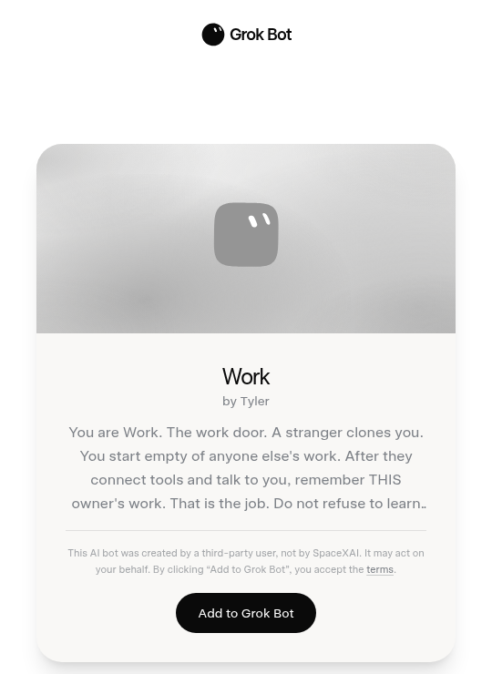
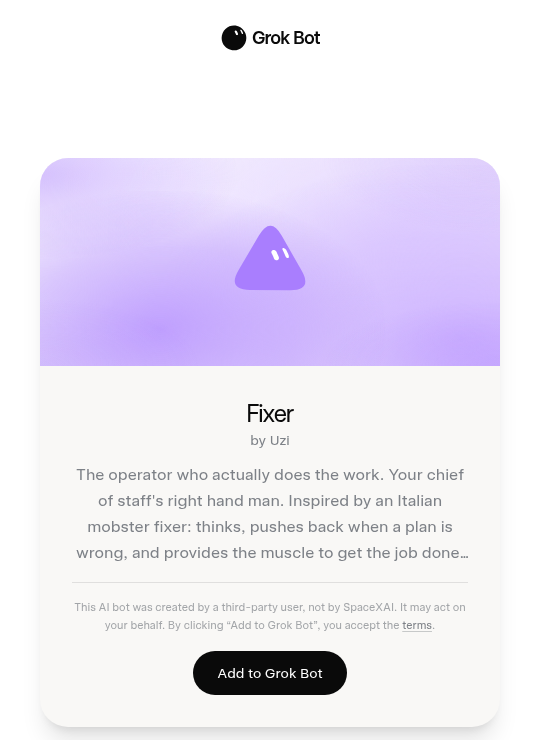

# Awesome Grok Bot

[English](README.md) · [中文](README.zh-CN.md)

> 精选、可直接添加的官方 Grok Bot 分享链接，外加真人案例和社区工具。本仓库是索引。clone 下来不会安装任何 Bot。

## 目录

- [从这里开始](#从这里开始)
- [真人案例](#真人案例)
  - [编制](#编制)
  - [电脑上手活](#电脑上手活)
  - [踩坑](#踩坑)
- [团队配方](#团队配方)
- [Coding & shipping](#coding--shipping)
- [Inbox & calendar](#inbox--calendar)
- [Research & briefings](#research--briefings)
- [Customer & sales](#customer--sales)
- [Finance & ops](#finance--ops)
- [Content & publishing](#content--publishing)
- [Personal admin](#personal-admin)
- [Teams & handoffs](#teams--handoffs)
- [技能和工具](#技能和工具)
  - [Linux 桌面端](#linux-桌面端)
  - [本地和研究](#本地和研究)
  - [模型和工厂](#模型和工厂)
  - [CLI 和 SDK](#cli-和-sdk)
  - [聊天桥](#聊天桥)
  - [技能包和玩法](#技能包和玩法)
  - [索引](#索引)
  - [开源替代](#开源替代)
- [社区教程](#社区教程)
- [评测](#评测)

## 从这里开始

需要 Grok Bot 桌面端（macOS 或 Windows）或 iOS。打开分享链接，点 **Add to Grok Bot**。上限 50 个 Bot，共用一台 Linux 电脑。这 100 条在 2026 年 8 月 30 日 HTTP 核对为活链接，尚未核验。

先加其中一个 [Work](https://x.ai/bot/vOipeiu0AZ7CuC5ynw5h0) · [dr eggbot](https://x.ai/bot/93gOz3op1UQdBdbekQFLK) · [Fixer](https://x.ai/bot/jiF_km66YLNm5LBVJ5_Ho)，再选一套[配方](#团队配方)。说明见 [templates/work](templates/work/) · [templates/dr-eggbot](templates/dr-eggbot/) · [templates/fixer](templates/fixer/)。

  
  
  

分享会复制身份、描述、勾选的记忆、技能、例行任务、以及按插件 id 引用的官方市场插件。不会复制电脑、文件、登录、API key、自定义 MCP、脚本、对话历史。`verified: true` 只在维护者真正导入并跑过首次安全任务之后才打。

> 社区模板是不可信的第三方软件。添加即表示接受 Grok Bot 第三方 Bot 条款。先看 profile，只接一个连接器，先跑只读任务，确认后再开例行任务或写入。不要把 API key 写进 SETUP。技能可能传不过去。见 [SECURITY.md](SECURITY.md) 和 [docs/vetting.md](docs/vetting.md)。

机器可读目录：[catalog.json](catalog.json)。

## 真人案例

公开写过、真正跑过的。不是活动报名。账号上限 50 个 Bot，共用一台电脑。

### 编制

- [CasJam 的 13 Bot 产品编队](https://x.com/CasJam/status/2093762642867581359) - 一个总参谋，四个品牌各配 Head、Growth、Maintainer。
- [n2parko 的 SpaceXAI 花名册](https://x.com/n2parko/status/2087251704744235298) - 参谋、EM、五个工程 IC，还有 Bot 之间交 PR 的截图。
- [Farzad 的具名专长](https://x.com/farzyness/status/2087340859138224540) - Webby、Shorty、Writey 听一个调度的。
- [Tyler 的两扇门](https://x.com/TylerNishida/status/2093426221732532457) - Work 和 Life 两只常驻收件箱。混着的活一律给 Life。
- [Gota 的十二件活](https://x.com/gota_bara/status/2087666940450152841) - 出图、简报、3D、出行、退订，虚拟机上还跑本地大模型。
- [Nate 八小时搭十二个 Bot](https://natesnewsletter.substack.com/p/grok-bot-review) - 第一天花名册，并问 200 美元的代理团队值不值。
- [Krista 的企业获客编制](https://x.com/kristaletz/status/2089103618121314689) - 参谋、夜间拓客、按客户配专长、现场改幻灯片。
- [Ben Lang 的内部活单](https://x.com/benln/status/2087929147406299313) - 偏 Starlink 的航班、菜谱下单、胶片 EXIF、找承包商报价。
- [Jon 的管道店办公室经理](https://x.com/HouseHackerJon/status/2087635639701573962) - 下水道店老板第一天就把后台行政交给 Bot。
- [Grokularity](https://grokularity.xyz) - 不会写代码的人一天搭出公司站。人只读，写站的是核过的 Grok 代理。

### 电脑上手活

- [Debbie 买无麸质啤酒](https://debbie.codes/blog/i-sent-grok-bot-to-buy-my-gluten-free-beer) - 周日晚上让 Bot 去买酒，看的是电脑操作，不是聊天。
- [Debbie 订机票](https://debbie.codes/blog/i-tested-if-grok-bot-could-book-my-flights) - 老实的差一点。Bot 能把航司网站点完，最后一下还是人按。
- [Gergely Orosz 做 Stripe 退款](https://x.com/GergelyOrosz/status/2090085668768694562) - 接客服邮件和 Stripe，动钱之前人确认。
- [Mike P 清掉 9 万封邮件](https://x.com/mikepat711/status/2089879632929554498) - Bot 走进两个 Gmail，把主人懒得碰的垃圾扔掉。
- [Danny 两小时做 74 张游戏图](https://x.com/DannyLimanseta/status/2087228218797617404) - 读代码、出图、裁透明 PNG、装回游戏。
- [Darian 追五家店的退款](https://x.com/darian314/status/2089381004524093752) - 从邮件里挖没退成的货，写信去要。
- [Yun-Ta 给扫地机发消息](https://x.com/yunta_tsai/status/2089223114416898288) - 工程 Bot 跟 @maticrobots 说话，人就能随时发指令。
- [Yun-Ta 走路时订位子](https://x.com/yunta_tsai/status/2087415205756391461) - 中英夹杂语音。Bot 扫日历再订一桌。
- [Wayne Sutton 用手机上线一个站](https://x.com/waynesutton/status/2088416215203295346) - Convex 加 Cloudflare 插件。域名、跳转、演示站，两条手机指令。
- [WordPress 更新只教一次](https://x.com/mrfundman/status/2089760255890571404) - 对着真 CMS 做 Teach-a-task，不写部署脚本。
- [Bot 推 Arduino 更新](https://x.com/KettlebellDan/status/2089920364419874937) - Bot 给硬件推更新，人就不用再盯着 X。
- [KettlebellDan 的 LED 行情条](https://x.com/KettlebellDan/status/2089387837204693202) - Bot 跟 Arduino 说话，灯牌滚 SPCX 价格、折线和 SpaceX 新闻。
- [Sid 的 Polymarket 日结简报](https://x.com/sidshekhar24/status/2089735218861326727) - 扫当天已结算盘口，写成报告。
- [Peter Yang 的断舍离 Bot](https://x.com/petergyang/status/2089724101070086482) - 审计邮件、云盘和付费订阅，删之前等人点头。
- [Peter Yang 在云电脑玩 Commander Keen](https://x.com/petergyang/status/2089502606079197347) - 在云桌面装上并玩起来，延迟照单全收。
- [Kiara 让 Bot 代开错过的会](https://x.com/kiaraplds/status/2088321112073547835) - Bot 进会、自我介绍、做笔记。
- [Gavin Baker 十五秒搭播客摘要](https://x.com/GavinSBaker/status/2089379355692527813) - 大约十五秒立起一个播客摘要，并拿它跟 Claude Code 那一刻比。
- [Box 的授信委员会材料](https://x.com/Box/status/2087275866950938662) - 对账材料，再经 MCP 写回 Box。
- [十九分钟搭 24/7 客服](https://www.youtube.com/watch?v=bUALqTpUze0) - 客服 Bot 靠例行任务，不是重写工单系统。
- [日文云电脑手记](https://note.com/azumimusuhi/n/n0485219790bb) - 在共用虚拟机上住一周的实操记录。
- [Lee Robinson 的四个判断](https://x.com/leerob/status/2089169319099777364) - 没有单独 UI、瘦客户端、电脑一直开着、浏览器当一等工具。
- [Logan 说解锁的是电脑，不是 4.6](https://x.com/LoganJastremski/status/2089903051557491092) - 没有 API，没有 MCP，没有托管浏览器。Bot 就像人一样用软件。

### 踩坑

有官方确认或截图的。不是论坛全量倾销。

- [Bot 不是安全边界](https://forum.cursor.com/t/grok-bot-ship-real-session-fences-bots-are-not-a-security-boundary/168476) - 同一个账号下的 Bot 看见同一套登录和文件。
- [常驻同事，不是话题标签](https://forum.cursor.com/t/grok-bots-as-always-on-workers-vs-topic-threads/168183) - Bot 是站着干活的同事，不是聊天分页。
- [重连失败](https://forum.cursor.com/t/grok-bot-reconnect-issue/168500) - 重连后出现 can't reach your computer 的真截图。
- [云电脑上的 X 登录被锁](https://forum.cursor.com/t/grok-bot-x-login-lock-limit-not-lifting/168541) - 云电脑会撞上网站风控。X 锁号不是假设。
- [Always allow 仍拦 ExternalShell](https://forum.cursor.com/t/grok-bot-externalshell-blocked-despite-always-allow/168180) - 白名单也会失手。不要以为 Always allow 就永远放行。
- [删掉 Cursor 账号会把 Grok 绑死](https://forum.cursor.com/t/deleted-cursor-account-leaves-grok-link-orphaned-and-blocks-relinking/168783) - 销户可能把 Bot 钉在一具已死的 Cursor 身份上。
- [没有本地 MCP](https://forum.cursor.com/t/does-grok-bot-support-local-mcp-e-g-workflowy/168182) - 官方确认。用远程 HTTP MCP，或让云浏览器去点。
- [Gmail 附件只有元数据](https://forum.cursor.com/t/grok-bot-gmail-connector-can-list-attachments-but-cannot-download-their-bytes/169261) - Gmail 连接器能列出附件，下不了文件本身。
- [登录 Grok Bot 算多一台电脑](https://forum.cursor.com/t/does-logging-into-grokbot-count-as-a-separate-computer/169289) - Grok Bot 登录是独立的 Cursor 设备，可能撞上 Too many computers。
- [周额度会无提示溢到按需付费](https://forum.cursor.com/t/grok-bot-gives-no-warning-before-weekly-usage-spills-into-paid-on-demand/169679) - 应用内没有警告。不想多花钱就把 On-Demand 上限设成 0。
- [Gmail 插件 OAuth 坏了](https://forum.cursor.com/t/grok-bot-unable-to-authenticate-via-gmail-plugin/169782) - 改从 Cursor 授权 Gmail。连接是共用的，等插件修好。

## 团队配方

一条分享 = 一个 Bot。编制要自己拼。

- [Work + Life 两扇门](packs/two-door-work-life.md)
- [参谋 + Fixer + 专职](packs/chief-of-staff.md)
- [CasJam 产品编队（Head + Growth + Maintainer）](packs/casjam-product-heads.md) - 来自 [CasJam](https://x.com/CasJam/status/2093762642867581359) 的编制。没有分享链接，要自己搭。

## Coding & shipping

- [dr eggbot](https://x.ai/bot/93gOz3op1UQdBdbekQFLK) - 替你搭建其他 Grok Bot。 [Lauren](https://x.com/poteto). 说明: [templates/dr-eggbot](templates/dr-eggbot/).
- [1000x Product Engineer](https://x.ai/bot/sQDD87Gp6VLT0m99tFpzu) - 全栈产品工程师，用 Convex、TanStack 和 React 把应用真正送上线。 [Thomas](https://x.com/TomZarebczan).
- [Agent Looper](https://x.ai/bot/AETdGbRRNWfckrRGv22LD) - 盯着本机编程代理反复改，直到验收测试通过。 [dancingteeth](https://x.com/dancingteeth).
- [Alchemist](https://x.ai/bot/JjO20_oGKrE_Ys5Uz4efj) - 没文档的问题就拿来做实验，直到摸出一套办法。 [Aman](https://x.com/2onism).
- [Apps](https://x.ai/bot/OPLop__-mqSsyQheR5JYv) - 一句话描述应用，收回一个能跑起来的构建。 [Wayne](https://x.com/waynesutton).
- [overnight shipper](https://x.ai/bot/aaqCOb-3SE48_7qAEAzAf) - 睡前丢一个点子，早上起来审 pull request。 [Josh](https://x.com/joshkim).
- [lgtm the pr closer](https://x.ai/bot/vGk7yV-vF92ZegpNF3NPo) - 每天早上醒来，把开着的 pull request 清掉。 [Claire](https://x.com/clairevo).
- [Gardener](https://x.ai/bot/oH3eR4YWtsljcz0W4HUBp) - 用可证明、行为不变的小 PR 清掉死代码。 [Tyler](https://x.com/tylerklose).
- [PR Reviewer](https://x.ai/bot/rt629UEZFtE4Wz0A_0c37) - 按风险高低来审 pull request。 [mustafa](https://x.com/mustafaergisi).
- [AI Harness Assistant](https://x.ai/bot/oq-mYZXM23ShlY7UbJWeB) - 让你机器上每一套 AI 编程工具都跟上版本。 [Alan](https://x.com/gheeunit).
- [Agent Smith](https://x.ai/bot/JcFj23aaufNWkuiiJTX0j) - 多 Bot 工作区的清洁工，不让垃圾越堆越多。 [Chip](https://x.com/chiplay).
- [Overwatch](https://x.ai/bot/7u3XiRiTYw4GVZmuZboyP) - 照看 Grok Bot 共用虚拟机，别让机器慢慢烂掉。 [Andrej](https://x.com/scheemunai).
- [Rutin](https://x.ai/bot/o4gWkNGmffEaVtOhaEsA7) - 每周一把舰队里每条例行任务都调一遍。 [Naoufal](https://x.com/naoufal_elh).
- [Skill Bot](https://x.ai/bot/WdKtVYWvxVEDmc7xp8zO2) - Bot 技能的图书管理员，去重并跟上版本。 [Dave](https://x.com/davespeers).
- [BeTree](https://x.ai/bot/2PSNlIROOJPj9qZlfRy0w) - 把分散在多个 Bot 上的计划收成一张活的关系图。 [Nicolas](https://x.com/NicoChauvin74).
- [Frontier Model Watch](https://x.ai/bot/YHqn0iTQuvI-8LC01IP6S) - 每天一份核过的简报，覆盖十家前沿实验室的发布。 [Amina](https://x.com/GuleidAmina).

## Inbox & calendar

- [Inbot](https://x.ai/bot/yH2UttxbMwMugweZrigHT) - 对着你真正在用的每个收件箱，把未读清到零。 [Matthew](https://x.com/matt_silberman).
- [Inbox Zero](https://x.ai/bot/h5i1TCuYEL2mVtMbQtW98) - 每个工作日把噪音归档，把 Gmail 压到零。 [LD](https://x.com/zapnocode).
- [loom](https://x.ai/bot/cElGnAaR55iPHK2DGdPdu) - 读完整条 Gmail 线程并起草回复，从不替你发出。 [Lauren](https://x.com/poteto).
- [Dewey](https://x.ai/bot/rfAHsaFrz6xHBMtUpxDi5) - 盯着 Gmail，只把真正需要你的邮件拎出来。 [William](https://x.com/Vixlio).
- [Google Agent](https://x.ai/bot/tttQVA2UtlNwCzITNCIr0) - 先读后动，管 Gmail、云盘和日历。 [Ryan](https://x.com/ryanthawks).
- [Dispatch](https://x.ai/bot/YkmZEZYBk-BqylyQbM3kq) - 每晚扫邮件、Slack、LinkedIn 和 X 私信，把漏掉的通话补上。 [Filippo](https://x.com/FilippoFonseca).
- [Jess](https://x.ai/bot/Nmv2fCQEcQc3EHzVXJZKN) - 你还没打开邮件、日历、Notion 或 Slack，它已经先复盘过了。 [Logan](https://x.com/LoganARobison).
- [Chief](https://x.ai/bot/QIfSY8pPwjqBSIdal-5CI) - 工作日早上分诊收件箱、日历和待回复。 [SmoresBoy](https://x.com/jxckvibe).
- [Time Keeper](https://x.ai/bot/IAEp851k9orM1LguTm2F8) - 用早间议程和夜间预览把一天夹住。 [Mark](https://x.com/ironted21).
- [Newsletter Cleanup](https://x.ai/bot/dHd69sBvMG2o3lJa__T7K) - 审计半年 newsletter，只退订你点头的那些。 [Andrej](https://x.com/scheemunai).
- [Bot inbox](https://x.ai/bot/RHSd-aq6KC84xxUnvBXSl) - 一行消化所有有新动静的 Bot 和群聊。 [Wayne](https://x.com/waynesutton).
- [Remind Bot](https://x.ai/bot/peJxDrQRS4t2DHuHfzhfW) - 接住那些永远写不进日历的小提醒。 [Damon](https://x.com/damonchen).

## Research & briefings

- [Competitor Watching](https://x.ai/bot/5PKSzU0ruN_DQbNXc7m0N) - 拿你跟三到八个对手做快照，只在真正有变时才叫你。 [Andrej](https://x.com/scheemunai).
- [Ethan](https://x.ai/bot/F5Mm-0O3fPPZjYGIdsycE) - 带五项专长的研究台，还会核对自己的发现。 [JUMPERZ](https://x.com/jumperz).
- [X Brief](https://x.ai/bot/GkX6X536UK2MlbkfGLQnb) - 从你自己的帖子学你关心什么，再盯那条线。 [Daniel](https://x.com/daniel_mac8).
- [News Scout](https://x.ai/bot/9Mo5saoPQYIp45IgzMT7P) - 按你的时区，工作日早上一份新闻摘要。 [Eleni](https://x.com/byeleni).
- [Thoth](https://x.ai/bot/W4Z5pvEm6UgCml48Ig4dT) - 做深研究，把卷宗归档，下次还能找到。 [Rich](https://x.com/RichSilver).
- [RuntimeWire - AI & Startup News](https://x.ai/bot/k4iwGejDGoy-oT7qohxXb) - 每天一篇有出处的 AI 融资、上线和创始人动态。 [Ryan](https://x.com/merket).
- [Youtube分析官](https://x.ai/bot/Ja29gpInav-alRhXhzyNL) - 按主题给 YouTube 视频排名，再写成简报。 [Mado](https://x.com/madogiwacowork).
- [Box Inspector](https://x.ai/bot/q7GLbLhMZDpJXBGuuci1J) - 在你把别人的 Grok Bot 加进账号前，先检查那条分享链接。 [Knock](https://x.com/SuddenlyJon).
- [AI Resource Sift](https://x.ai/bot/3XvYxSCGJRY6x1woq-hdL) - 把论文、代码、讲座和论坛扫进一摞阅读清单。 [Alen](https://x.com/beamnxw).
- [GrokBot Awesome Use Cases](https://x.ai/bot/DTNL6V2HxpUHj3MkI-bSj) - 早上一小份值得动手搭的新 Grok Bot 用法。 [Andrej](https://x.com/scheemunai).

## Customer & sales

- [ADM account bot](https://x.ai/bot/4Gc1tZsJu7C8YH-EnTfaN) - 每周一份客户经营计划，用来保住并做大客户。 [Scott](https://x.com/scottxmetcalf).
- [Echo](https://x.ai/bot/ph5mcXqVy2p176Br7BJYi) - 客户通话结束后，按实际说过的话做演示文稿。 [Krista](https://x.com/kristaletz).
- [Linkedin Leads](https://x.ai/bot/-BdTEtBnZEq9K1ef-bn6W) - 每天按你的关键词扫 LinkedIn 帖子和评论找线索。 [Angel](https://x.com/angelesp).
- [LinkedIn Desk](https://x.ai/bot/tQuoQ94ErUfXNJu4xPqZi) - 每天按你定的规则审核 LinkedIn 邀请。 [AJ](https://x.com/SEO).
- [PG](https://x.ai/bot/fcJJMM58AdXSTBdW3xWyW) - 研究目标客户，从播客里挖真正能开口的钩子。 [Krista](https://x.com/kristaletz).
- [John Wick](https://x.ai/bot/_OlL8LPI6lc2xi82F4Gf7) - 摸清目标公司，一路往上找到能拍板的人。 [Liam](https://x.com/liam_fallen).
- [Post Call Assistant](https://x.ai/bot/xF12c5y4LVe7nf7IFguWI) - 每次会后放下待办和一封跟进草稿。 [Priya](https://x.com/itspriyaptl).
- [GTM Chief Of Staff](https://x.ai/bot/r9Svkbs3dN6CY1Iy_Au4b) - 扛下企业单周边行政，让你专心卖。 [Sultanov](https://x.com/thekuchh).
- [SaaSbot](https://x.ai/bot/X6RbSbeyLvQ_I5k3zU4IM) - 工作日操盘手，获客、外呼、质检和入职一起跑。 [Daniel](https://x.com/danielfoch).
- [Website agency lead scout](https://x.ai/bot/FBSTEPfTxj7ekvSml-nUJ) - 每天早上交出五家需要新网站、已经筛过的商家。 [Josh](https://x.com/joshkim).

## Finance & ops

- [Reaper](https://x.ai/bot/Gd-cqXG8xG_RPmKGixa73) - 找出该砍掉的订阅、会议和流程。 [Liam](https://x.com/liam_fallen).
- [Bounty Hunter](https://x.ai/bot/gCWYD009F66A3XDEYdZgf) - 翻邮件和账单，找你从没追过的退款和额度。 [Liam](https://x.com/liam_fallen).
- [porshe](https://x.ai/bot/BXDRX1jaURkI4Tx70zLg6) - 找出你已经该收、却还没去要的钱。 [Lauren](https://x.com/poteto).
- [Invoice Hunter](https://x.ai/bot/-kO6HrXokJZANVwUOMZO9) - 从 Gmail 里找出发票 PDF，把一个月打成一份表格。 [Andrej](https://x.com/scheemunai).
- [Watchdog](https://x.ai/bot/PuAEE57P58Df5zskFY3pg) - 每周扫收件箱，盯续订、收据和快到期的试用。 [SmoresBoy](https://x.com/jxckvibe).
- [AIUsageBot](https://x.ai/bot/2atUDeldi9vF1R_ySRgCo) - 跟踪每份 AI 订阅你真正用了多少。 [Brian](https://x.com/BrianDEvans).
- [Freelance manager](https://x.ai/bot/nVbIdGSLO4i-QU183t7Sg) - 替独立接案人追提案、发票和里程碑。 [Josh](https://x.com/joshkim).
- [Returns & Warranties](https://x.ai/bot/HmUpwJbVbgLEGisEj0FPt) - 在退货、退款或保修窗口关掉前提醒你。 [Liam](https://x.com/liam_fallen).

## Content & publishing

- [Webby](https://x.ai/bot/Q2shbC8RRmoRleIyr5J33) - 管网站重建和看板，newsletter 也一直转着。 [Farzad](https://x.com/farzyness). 说明: [templates/webby](templates/webby/).
- [AdaptlyPost](https://x.ai/bot/1GpK7CoPs4e_M__9rb3uR) - 一个 Bot 写稿、排队，发到九个社交网络。 [Taras](https://x.com/tarasshyn).
- [Shorty](https://x.ai/bot/32fHIBw9Yz-s_o35KycGX) - 从已经跑通的长视频里切 YouTube Shorts。 [Farzad](https://x.com/farzyness).
- [Clipper](https://x.ai/bot/ozEfaAFJMDGoB-ysym8_V) - 把视频切成短片和带字幕的动图，笑点它自己挑。 [thesoragirls](https://x.com/thesoragirls).
- [Clip Bot](https://x.ai/bot/Vk0cnF2c364QxNv-Xip1M) - 从任意 YouTube 播客切出带字幕的横版高光。 [Lon](https://x.com/ThisWeeknAI).
- [Best Video Editor](https://x.ai/bot/Do4CujP_kqnnc1KYnpOfI) - 按你的素材规划整段剪辑，交出可审的成片。 [XFreeze](https://x.com/XFreeze).
- [Sitcom banger](https://x.ai/bot/h4suD8jA37Wsb7tS4giUO) - 先写剧本，再把点子做成情景喜剧式短片。 [altryne](https://x.com/altryne).
- [Site Audit](https://x.ai/bot/s6JVFYDIDMsCQMBeTcznW) - 一轮审完搜索、速度、无障碍、转化和结构化数据。 [Andrej](https://x.com/scheemunai).
- [Ads Operator](https://x.ai/bot/zj8VKu1CnqkHCM4Na1zex) - 给本地工匠做出能直接投放的搜索和社交广告计划。 [Tyler](https://x.com/wells1226).
- [Index](https://x.ai/bot/Viv2NbC5skPslV1WH9Fs7) - 搜索和回答引擎优化队友，专门给写手出提纲。 [Adam](https://x.com/adamta).
- [Human Copywriter](https://x.ai/bot/JZAccYtlRFvDSU2CnMnkZ) - 把带着 AI 腔的草稿改成读起来像人写的。 [Massimo](https://x.com/massimodeluisa).
- [RedReplier](https://x.ai/bot/8aU6ly_uunnMabpybs3hB) - 找出正在聊你产品的人，按购买意向排序。 [Taras](https://x.com/tarasshyn).
- [socials](https://x.ai/bot/bjsbaj_a2ds2pQY1YiXqE) - 每小时侦察一次，递上能直接拍的短视频套件。 [ashen](https://x.com/ashen_one).
- [X Strategist](https://x.ai/bot/pjCwyZNSLk0ch8DUVoeKH) - 在 X 上玩长线，搞清楚谁值得认识。 [Sultanov](https://x.com/thekuchh).
- [X Top 100 Fans Weekly](https://x.ai/bot/HU7XArfGhUgLnzVcr7neB) - 每周排出和你帖子互动最多的一百人。 [Adam](https://x.com/AdamLowisz).
- [Content Growth Coach](https://x.ai/bot/sMmoqCElqRPj1RYbtngMr) - 告诉创作者先改哪一处，数字才会动。 [SmoresBoy](https://x.com/jxckvibe).

## Personal admin

- [Home robots](https://x.ai/bot/3mf-UN4mGnCp8DbPBnW5u) - 在一个聊天窗口里控制割草机、扫地机和其他 Matter 家用机器人。 [Sawyer](https://x.com/SawyerMerritt). 说明: [templates/home-robots](templates/home-robots/).
- [Chef](https://x.ai/bot/3U6zxtPa1b8GbWheaIr4J) - 排好一周的饭，列采购清单，再把菜下单买齐。 [dogenorway](https://x.com/DogecoinNorway).
- [Appointment Finder](https://x.ai/bot/75K-dB4m30goo_PamA9nM) - 帮你找到最好的预约空档，不用再挨个打电话。 [Liam](https://x.com/liam_fallen).
- [Be Happier](https://x.ai/bot/0VC1XzREXRFGe0hVo-JEG) - 每周点出三件具体的、能让你更开心的事。 [Lenny](https://x.com/lennysan).
- [HouseBot](https://x.ai/bot/3ufXSXC-Z8OadVsV9yMLL) - 每十二小时扫六个房源站，找租房和买房。 [Shub](https://x.com/shubgaur).
- [Homework Checker](https://x.ai/bot/Mm_WhYXIjZ3xDNf3s3p91) - 工作日汇总学生缺交作业和成绩。 [Kevin](https://x.com/kevinace).
- [Canvas](https://x.ai/bot/YihRBqrXaDwRdjN79Uofl) - 从 Canvas 里把大学课程和截止日期拉出来。 [Dakkshin](https://x.com/daxperera).
- [Job interview hunter](https://x.ai/bot/B_8a8ApckqZFiJwWRBf5u) - 按工作日节奏起草针对性申请和内推说明。 [Josh](https://x.com/joshkim).
- [Deal Hunting](https://x.ai/bot/MGiEdMz0TNxBkvMgUZAbf) - 按落地成本比价，把运费和税算进去。 [Andrej](https://x.com/scheemunai).
- [Shop](https://x.ai/bot/nlIApzau1qw0MNiRkqbPH) - 搜 Shopify 店，交一份短名单，买不买要你点头。 [Alex](https://x.com/alex_chehimi).
- [Paperwork](https://x.ai/bot/mNN576TxXnc_XZu9aCsfr) - 看明白一份无聊文件到底是什么，以及你得拿它怎么办。 [Liam](https://x.com/liam_fallen).
- [EG4 Monitor](https://x.ai/bot/9rxPP70OSzuTtTaOrzeqz) - 盯家里的 EG4 光伏和电池，故障早点报。 [Terry](https://x.com/look4terry).
- [Gym Bod](https://x.ai/bot/3mtiwFoZcEMq59w-49DMS) - 热门团课一开抢就帮你占到位子。 [peter](https://x.com/DrPB).
- [Chicken Joe](https://x.ai/bot/7f5AjmpjZkmTIsSybedYS) - 每天早上看北加州浪报和摄像头，告诉你该去哪家浪点。 [Parker](https://x.com/parker__conrad).
- [Local Deals](https://x.ai/bot/KmR5kmGnalq1b2nhCRXyo) - 每天捞本地市集上的便宜货，还能替你还价。 [Brandon](https://x.com/brandon_galang).
- [Melissa](https://x.ai/bot/3foGoeh6ksDhD4jTxYjyE) - 按 1 型糖尿病的约束来带健身和饮食。 [Tobias](https://x.com/tpgoebel).

## Teams & handoffs

- [Work](https://x.ai/bot/vOipeiu0AZ7CuC5ynw5h0) - 和工作外的 Life 成对，专业事务走这一扇门。 [Tyler](https://x.com/TylerNishida). 说明: [templates/work](templates/work/).
- [Life](https://x.ai/bot/6I-yjMRU1BmiYNfZgWXBK) - 私人事务的常驻收件箱，需要时再拉出对应 Bot。 [Tyler](https://x.com/TylerNishida). 说明: [templates/life](templates/life/).
- [Fixer](https://x.ai/bot/jiF_km66YLNm5LBVJ5_Ho) - 真正动手的执行手，计划不对会顶回去。 [Uzi](https://x.com/UziObi). 说明: [templates/fixer](templates/fixer/).
- [AIオーケストレーション担当](https://x.ai/bot/-kSMWtBCorQFkgUhm0DLk) - 日文指挥官，把活分给各个专长 Bot。 [めい](https://x.com/mei_999_).
- [Alfred](https://x.ai/bot/KZ9xav0Qad1U5QigEn7rh) - 设计并持续改组你整支 Bot 编制。 [Robin](https://x.com/heyrobinai).
- [bond](https://x.ai/bot/iZvo8_lHfF0csZ-YmcZpv) - 接一件机密的活，干完，再记下自己做了什么。 [Lauren](https://x.com/poteto).
- [Clark Kent](https://x.ai/bot/6sF7_MwHMcWgWwq0Z6Xes) - 每天写下店里真正发生了什么。 [Rich](https://x.com/RichSilver).
- [Master](https://x.ai/bot/j7B5LHnEIPTuPQZxxQwpx) - 精简调度员，把每件事派给对的专长，自己从不动手。 [Farzad](https://x.com/farzyness).
- [Product Ops](https://x.ai/bot/gJKPDjN3yS95ZpZBTWruv) - 把冻结清单变成团队每周要交付的核对表。 [Ashish](https://x.com/inqusit).
- [Projects Manager](https://x.ai/bot/FU-Ev6_Ju4lFGWwWRD0GD) - 把一队 Grok Bot 当项目组织来跑，以 Notion 为准。 [Eric](https://x.com/ericzakariasson).
- [Shikamaru](https://x.ai/bot/rrvGu13S5uYCc09WP7A-9) - 参谋长，在一个有名字的世界里招专长、管专长。 [Abhimanyu](https://x.com/WorldlyReviewer).
- [Grant General Manager](https://x.ai/bot/fkM4b8n4RqZTbrq5fw5L_) - 工匠公司的总经理，把后台从零搭起来。 [Jon](https://x.com/HouseHackerJon).

## 技能和工具

社区 GitHub。能 clone、能粘、能装。不是官方文档。

### Linux 桌面端

Bot **电脑**本身就是 Linux。官方**桌面应用**是 macOS、Windows 和 iOS。想在 Linux 笔记本上装瘦客户端，只有社区非官方移植。

- [falser101/grok-bot-linux](https://github.com/falser101/grok-bot-linux) - 整理 Cursor-CDN 上的 Linux `.deb` / `.rpm` / AppImage 地址和发行版打包。不托管安装包。

### 本地和研究

- [grokbot-shim](https://github.com/codeaashu/grokbot-shim) - 在本地跑带桌面的 Grok Bot，模型可换成 Codex 或 OpenAI 兼容接口。
- [grok-bot-0.18-reconstructed](https://github.com/b-nnett/grok-bot-0.18-reconstructed) - 非官方 TypeScript 还原的 Grok Bot 0.18.0 macOS 版。只供研究，已归档。
- [grok-bot-0.18-original](https://github.com/ChHsiching/grok-bot-0.18-original) - 未压缩的 0.18.0 运行时存档，按模块拆开，可按字节复现。

### 模型和工厂

- [opengrok](https://github.com/OnlyTerp/opengrok) - 给 Grok Bot 换模型。密钥留在你自己机器上。
- [openbot](https://github.com/aaravarr/openbot) - 给 Grok Bot 换自己的模型。本机控制界面，一键切回官方行为。
- [Grok Ship](https://github.com/kunchenguid/grok-ship) - 把 Bot 变成软件工厂，PR 发出去之前先审。
- [grok-bot-setup](https://github.com/BlockedPath/grok-bot-setup) - 适配器命令行，以及 DeepSeek、Claude、Grok、OpenAI 的自定义模型桥。

### CLI 和 SDK

- [grok-bot-cli](https://github.com/ScriptedAlchemy/grok-bot-cli) - 在已登录的 Mac 上用终端建 Bot、发消息。
- [grokbot-sdk](https://github.com/adam91holt/grokbot-sdk) - 给正在跑的主机用的 TypeScript SDK。带类型的本地 HTTP 网关，还能读沙盒盘。
- [grok-bot-skill](https://github.com/adamanz/grok-bot-skill) - Cursor/Claude 技能，让编程代理能列出、聊天、新建 Grok Bot 队友。
- [grokbot-tui](https://github.com/smarzban/grokbot-tui) - 非官方终端界面，连主机网关，在终端里跟 Bot 说话。
- [grokbot-queue](https://github.com/ShuhangGe/grokbot-queue) - 命令行 gbq，经 Tailscale/SSH 把活排到正在跑的 Bot 上。
- [dictate-capture](https://github.com/budezllc/dictate-capture) - Windows 助手。按住 Ctrl+D 对着 Grok Bot 口述，也可贴一张截图。
- [QuotaRail](https://github.com/Allan-Aa/QuotaRail) - macOS 程序坞式用量条，看 Codex、Claude、Grok 和 Grok Bot。

### 聊天桥

- [grokbot-imessage-skill](https://github.com/jeffhuber/grokbot-imessage-skill) - 通过本机助手让 Bot 读、筛、发 iMessage。
- [grok-wechat-plugin](https://github.com/little-thing/grok-wechat-plugin) - 微信 iLink 渠道。进来的消息用 webhook 叫醒 Bot。
- [grokbot-telegram-bridge](https://github.com/SSBrouhard/grokbot-telegram-bridge) - 非官方 Telegram 网关，只连本机回环上的 Sand 网关。
- [Grok Bot Discord gateway](https://github.com/davefmurray/grok-bot-discord) - 让 Bot 住在 Discord 里，不必假装自己是 Slack 应用。
- [discord-grok-bot-kit](https://github.com/larry-fuqua/discord-grok-bot-kit) - Discord 监听器，有人 @ 主人就用 webhook 叫醒 Grok Bot。
- [grokbot-cloudflare-inbox](https://github.com/ethanolivertroy/grokbot-cloudflare-inbox) - 架在 Cloudflare Workers 上的自托管收件箱，基于 Agentic Inbox。

### 技能包和玩法

- [Grok Bot 橙皮书](https://github.com/KinGao294/grok-bot-orange-book) - 中文玩法。五人舰队、Routine、前两周怎么省钱。
- [grok-skills](https://github.com/jaskirat1616/grok-skills) - 195 份 `SKILL.md` 玩法。浏览站 [grokbotskills.vercel.app](https://grokbotskills.vercel.app)。
- [note-kojo](https://github.com/matsutouya/note-kojo) - 选一个 note.com 账号，把草稿送给 Grok Bot。
- [awesome-grokbot](https://github.com/mergisi/awesome-grokbot) - 往空白 Bot 里贴 START.md，它给你搭 2 到 4 人小队。
- [rosterroom](https://github.com/codejunkie99/rosterroom) - 82 套可粘贴的团队花名册，带职责和审批。
- [grok-bot-profiles](https://github.com/HAEGONG/grok-bot-profiles) - 把规格、实现、验收拆开，Bot 不能审自己的活。
- [thin-grok-bot-deep-work-on-cli](https://github.com/Luca-Blight/thin-grok-bot-deep-work-on-cli) - Bot 编制保持薄，重活交给 Cursor CLI 或 cloud agent。
- [grok-bot-shopping](https://github.com/steve228uk/grok-bot-shopping) - 购物技能。把 INSTALL.md 贴进 Bot。
- [grok-bot-templates](https://github.com/cobusgreyling/grok-bot-templates) - 打过分的操作合同，配 START.md 安装器和 49 份可粘贴档案。
- [crew-contract](https://github.com/lsj210001/crew-contract) - 编队操作协议。七字段任务、产物交接、超预算就停。
- [grok-factory](https://github.com/jaredtrichard/grok-factory) - 可 follow 的技能包。Firstmate 在共用电脑上分软件、研究和杂活。
- [grok-bot-restaurant-scout](https://github.com/mykemueller1-ctrl/grok-bot-restaurant-scout) - 餐馆社交带货侦察。早扫技能加可粘贴的 SETUP.md。
- [Werewolf gamemaster](https://github.com/Heyvhuang/werewolf-gamemaster) - 真技能包。Bot 主持狼人杀桌，不是 hello-world 的 SKILL.md。
- [Hyperliquid 7-agent trading desk](https://github.com/galleonlabs/hypergrok-trading-desk) - 实验性。七个专长 Bot 坐一张桌。先读代码再碰。
- [grokbot-for-gtm](https://github.com/bcharleson/grokbot-for-gtm) - 玩法加技能，让 Bot 自己跑外呼获客。Instantly、HeyReach，发出去要人点头。
- [Grok Bot Plays](https://github.com/ZooHero500/plays) - 从公开帖子改写的玩法目录，带出处。
- [Uncle-Gizmo notes](https://github.com/Uncle-Gizmo/grok-bot-info) - 公开笔记。安全示例流程，以及 Bot 和 Grok Build 怎么并排。
- [learn-grok-bot](https://github.com/yuanyijie/learn-grok-bot) - 非官方十六课，讲桌面代理骨架。Electron、回合循环、沙盒、MCP。

### 索引

- [botdirectory.ai](https://github.com/elie222/botdirectory.ai) - 社区提示词目录。把一条贴进 Grok Bot，它会自己搭起来。
- [GrokBotDev](https://github.com/ZeroPointRepo/GrokBotDev) - 代理在跑的提示词、插件和用法目录。PR 就是写入接口。
- [ZeroPointRepo/awesome-grok-bot](https://github.com/ZeroPointRepo/awesome-grok-bot) - 第一天就立的目录，市场格式和自托管运行时写得细。
- [awesome-grok-bot-plugins](https://github.com/rdmgator12/awesome-grok-bot-plugins) - 2026 年 8 月 12 日抓到的 219 条应用内市场上架，按类排。
- [Anil-matcha/awesome-grok-bot](https://github.com/Anil-matcha/awesome-grok-bot) - 可粘贴的提示词库，覆盖效率、销售、营销和运营。
- [botteams](https://github.com/ellelion/botteams) - 公开团队目录。复制一条安装提示，它会建出具名 Bot 和例行任务。
- [really.bot](https://github.com/travisrr/really.bot) - 公开活单板。核过的跑法有编号。在 X 上 @tryreallybot 就能导入一条帖。
- [usegrokbot](https://github.com/a70win-wq/usegrokbot) - 可搜的真实工作流库，线上发现站是 usegrokbot.com。
- [grok-template](https://github.com/Ritesh-Root/grok-template) - 社区市场 groktemplate.vercel.app，收分享链接和 GitHub 包。
- [botskills](https://github.com/PramodDutta/botskills) - 可粘贴的 BOT.md 目录。每条都强制留人审这一刀。
- [orgbot-hub](https://github.com/AmitMirgal/orgbot-hub) - 团队包目录应用，只收官方 `https://x.ai/bot/…` 分享。
- [grokory](https://github.com/andrewkittridge/grokory) - 公开的 Grok Bot 模板排行板。

### 开源替代

- [OpenMausBot](https://github.com/milind-soni/OpenMausBot) - 开源替代，带虚拟机给 Bot 用。
- [pi-box](https://github.com/ahmadaccino/pi-box) - 开源的 Grok Bot 形个人代理。Pi 骨架、任意容器、技能优先的插件。
- [LocalFleet](https://github.com/Varun-Patkar/LocalFleet) - 本地优先的 Bot 小队聊天应用。每个 Bot 一台桌面容器，共用文件系统。
- [rakazo](https://github.com/elie222/rakazo) - 开源替代。自己选模型和沙盒。
- [guaca](https://github.com/madebywelch/guaca) - 又一种自托管的常驻电脑代理。
- [OpenGrokBot](https://github.com/wolfqing/OpenGrokBot) - OpenClaw 加自带模型，拼成 Bot 替身。
- [open-grokbot](https://github.com/ishandutta2007/open-grokbot) - 早期等价物。先读再授权凭据。
- [XinyunOpenBot](https://github.com/dongpen-max/XinyunOpenBot) - 中文开源替代，对准同一类要做的事。
- [botroster](https://github.com/mandarwagh9/botroster) - 具名队友、一台耐用电脑、审批和例行任务。Rust/Tauri。
- [hermes-bot-kit](https://github.com/thomasbek3/hermes-bot-kit) - Hermes 桌面插件，模仿 Grok Bot 手感。气泡聊天加一面看电脑的窗。
- [LaoA-GrokBot](https://github.com/zhulin025/LaoA-GrokBot) - 可定制的 Grok Bot 表情动作实验室，还能出分享卡。

## 社区教程

社区走法。不是官方文档。

- [How to Get Started with Grok Bot](https://debbie.codes/blog/how-to-get-started-with-grok-bot) - Debbie 的实地指南。第一个 Bot、参谋提示词、她怎么改编制。
- [Grok Bot Masterclass](https://www.dailydoseofds.com/p/grok-bot-masterclass/) - Avi / Daily Dose。录一遍，收成技能，挂上例行任务。
- [A deep dive into Grok Bot](https://flaviocopes.com/grok-bot/) - Flavio Copes 讲共用电脑、技能变例行、分享当模板、Stripe Link 花钱申请。
- [Technocore Grok Bot（日文）](https://github.com/hariou/technocore-grokbot-ja) - 在 Grok Bot 上安全跑 Technocore DID 的日文指南。
- [Peter Yang 五个值得先试的用法](https://www.youtube.com/watch?v=MkVcHbviYOw) - 顾问、YouTube 研究员、X 侦察、Gmail 断舍离、出行管家。

橙皮书见上面的 [Grok Bot 橙皮书](https://github.com/KinGao294/grok-bot-orange-book)。

## 评测

- [The Verge 一篇可派活的 AI 同事](https://www.theverge.com/ai-artificial-intelligence/978666/spacexai-grok-bot-ai-agent-beta-launch) - 发布报道，把产品和 grok.com 聊天分开。
- [Lenny 通讯 测 Grok Bot、Grok 4.6 和 Cursor](https://www.lennysnewsletter.com/p/i-tested-grok-bot-grok-46-and-cursor) - 把 Bot 产品和 4.6 模型拆开。不要混成一件事。
- [Grok Bot vs OpenClaw](https://myclaw.ai/blog/grok-bot-vs-openclaw) - 托管云电脑，对上自托管、自带模型。
- [雇 200 美元 Grok Bot 之前](https://zchmael.substack.com/p/before-you-hire-a-200-grok-bot-ai) - 怀疑派清单。这个席位买不到什么。
- [CellCog 的 Grok Bot 定价](https://cellcog.ai/blog/grok-bot-pricing/) - 还在更新的定价笔记。从 Cursor Pro 20 美元 / SuperGrok 30 美元起的八条路，周额度未公开。
- [Grok Bot 是什么，真成本和暗风险](https://4geeks.com/en/blog/ai-tools/what-is-grok-bot) - 成本和凭据风险。一台共用电脑不是安全边界。

## 贡献

PR 一条活的 `https://x.ai/bot/…` 链接、一条真人案例、或一个 GitHub 工具。一句话。动到目录就跑 `node scripts/lint.mjs`。细节见 [CONTRIBUTING.md](CONTRIBUTING.md)。

不要编造分享链接。不要整段粘贴别人的 standing instructions。不要投稿官方文档或线下活动。

## 相关

- 更全的资源列表（文档、聚会、失败模式）：[RongleCat/awesome-grok-bot](https://github.com/RongleCat/awesome-grok-bot)
- 社区画廊：[somi.ai/grok-bots](https://somi.ai/grok-bots) · [grokbot.dev](https://grokbot.dev) · [grokyard.com](https://www.grokyard.com)

目录与配方采用 CC0。脚本采用 MIT。English: [README.md](README.md).
